# HRT Log 开发计划（待确认）

> 状态：**M1 前架构审查修订稿，尚未写任何应用代码**。2026-10-05 按《HRT_Log_项目会话转移包》更新；已确认决策见第 9 节，实施前验证项见第 10 节。计划经用户确认后再开始 M1。
>
> 参考源码：`TransmtfTeam/Transmtf-HRT-Tracker`，固定在提交 `8c9abdde`（2026-09-15）。下文所有 PK 参数都以**该提交的代码**为准，不以其文档为准，原因见 4.6。

---

## 1. 总体架构

### 1.1 模块划分

```
HRT-Log/
├── app/                 Android 应用：Compose UI、导航、Hilt 装配、构建变体 full / play
│   └── src/
│       ├── main/        共用界面与功能
│       ├── full/        伪装模式（计算器/笔记外壳、activity-alias、暗门）
│       └── play/        伪装模式的空实现（no-op）
├── core/
│   ├── domain/          纯 Kotlin：领域模型、给药规则展开、迟服/漏服判定、库存计算、单位换算
│   ├── data/            Room + SQLCipher、DAO、Repository、密钥管理、DataStore 设置
│   ├── reminder/        AlarmManager 调度、BroadcastReceiver、通知渠道、厂商电池优化引导
│   └── ui/              主题（浅/深/高对比/动态取色）、通用组件、图表组件
├── pk-engine/           纯 Kotlin/JVM，无 Android 依赖：从 Transmtf 移植的 PK 模型
├── importer/            纯 Kotlin：Trans Memo v8 导入器（读取层抽象为接口，Android 与 JDBC 各一实现）
├── tools/pk-reference/  Node 脚本：用上游 TS 代码生成一致性测试的参考曲线 JSON（仅开发用，不进 APK）
└── docs/                PLAN.md、pk-model.md、隐私说明等
```

几点说明：

- **`core/domain`、`pk-engine`、`importer` 不依赖 Android**，单元测试直接在 JVM 上跑，速度快，也能在没有 Android SDK 的 CI 中运行。提醒调度的核心逻辑（"下一次该在何时响"）放在 `core/domain`，`core/reminder` 只负责调用 AlarmManager。
- 功能界面（日历、历史、库存……）放在 `app` 里按包划分（`ui.calendar`、`ui.history`……），每个包有自己的 ViewModel。目前没必要拆成十几个 feature 模块，以后需要时再拆。
- 架构：MVVM + Repository + Hilt。ViewModel 只调用 Repository 和 domain 用例，并通过 `StateFlow` 向 Compose 暴露 UI 状态。

### 1.2 主要依赖（都不联网、不含统计）

| 用途 | 选型 | 备注 |
|---|---|---|
| UI | Jetpack Compose + Material 3、Navigation Compose | 每个界面都配 `@Preview` |
| DI | Hilt | |
| 数据库 | Room + `net.zetetic:sqlcipher-android` | 加密密钥见 2.4 |
| 设置 | DataStore（Proto） | 不含敏感内容的设置；敏感项放加密库 |
| 时间 | `java.time`（minSdk 26 原生支持） | 不用 desugaring |
| 图表 | ~~Vico 3.3.1~~ → **自绘 Compose Canvas 图表**（2026-10-05 变更） | 需要精确控制"记录实线 / 预测虚线 / 68%·95% 区间 / 化验点 / 用户参考范围带"，且无需新依赖；支持双指缩放、拖动、点按读数。Vico 不再引入 |
| PDF | Android 自带 `PdfDocument` | 不引入第三方库 |
| 密码哈希 | BouncyCastle `Argon2BytesGenerator`（纯 Java） | 不用 native 库，方便 F-Droid 构建 |
| 生物识别 | `androidx.biometric` | |
| 测试 | JUnit 5、Truth、Turbine、Robolectric、Compose UI Test；importer 测试用 `sqlite-jdbc` | |

不申请 `INTERNET` 权限。CI 中会检查合并后的 manifest，确认 `INTERNET` 权限不存在。

### 1.3 中性命名约定

- 包名 `net.plainnotes.app`，数据库文件 `notes.db`，诱饵库 `notes_b.db`，通知渠道 ID `reminders` / `supply` / `appointments`，SharedPrefs / DataStore 文件名 `prefs`。
- 类名中不出现 hrt / trans / hormone / estradiol 之类字样。领域里用的是 `Medication`、`Dose`、`Supply`、`Checkin`、`LabValue`、`ConcentrationModel`。分子枚举的**值**不可避免会出现药名，但持久化时只存短代码（如 `E2`、`SPI`），release 构建开启 R8 混淆。
- 应用的显示名称（`app_name`）是 "HRT Log" / "HRT 日志"，这是有意为之；伪装模式靠 activity-alias 实现。

---

## 2. 数据库设计

### 2.1 原则

1. **计划不落库**。计划服药由"给药规则"实时展开；数据库只存：已经发生的记录（服药 / 跳过 / 漏服）、被用户改过的单次计划（改期 / 跳过 / 改剂量）。
2. **时间 = UTC 时间戳 + 时区 ID**。凡是"真实发生的时刻"（服药时间、预约时间、化验采样时间），都存 `*_utc: Long`（毫秒）加 `*_zone: String`（如 `Europe/Paris`）。规则里的时刻存**本地墙钟时间**（`LocalTime`），展开时再结合当时的时区计算。
3. **墙钟计划槽位的身份 = 规则版本 ID + 原本地计划日期时间**，规范键为 `wall:<ruleVersionId>@2025-10-26T12:00:00`，采用 DST 修正前的时间，改期不改键。每 N 小时规则用 `elapsed:<ruleVersionId>#<occurrenceIndex>`，其中 k 为非负整数，以固定 UTC 锚点 `anchor_utc + k × N 小时` 展开，不从设备当前本地时间生成身份。键中的时间无 UTC 偏移、保留秒；类型前缀避免两种规则混淆。显示时间独立转换为当前时区，改期、跳过和剂量 override 始终绑定原键。跨时区需结合已触发和已完成状态去重；单靠键不能保证跨日期线时不遗漏计划。
4. **规则有版本**。统一使用 UTC 半开区间 `[effective_from_utc, effective_until_utc)`；结束为空表示无截止时刻。修改当天选定明确的切换时刻及其时区，将旧版本的 `effective_until_utc` 和新版本的 `effective_from_utc` 设为同一时刻。保留原本地生效日期供展示，不以两个版本都包含整天的方式切换。切换前的槽位及历史判定不变；切换前产生而改期到切换后的槽位仍保留。

### 2.2 ER 图

```mermaid
erDiagram
    MEDICATION ||--o{ SCHEDULE_RULE : "has"
    SCHEDULE_RULE ||--o{ RULE_TIME : "times of day"
    MEDICATION ||--o{ SLOT_OVERRIDE : "one-off changes"
    MEDICATION ||--o{ DOSE_RECORD : "history"
    MEDICATION ||--o{ SUPPLY_CONTAINER : "stock"
    SUPPLY_CONTAINER ||--o{ SUPPLY_TRANSACTION : "usage ledger"
    DOSE_RECORD o|--o{ SUPPLY_TRANSACTION : "consumption or reversal"
    MEDICATION ||--o| PK_PROFILE : "E2 only"
    CHECKIN_ITEM ||--o{ CHECKIN_SCORE : "rated"
    LAB_ANALYTE ||--o{ LAB_VALUE : "measured"

    MEDICATION {
        long id PK
        string name
        string molecule "E2 / T / P4 / CPA / SPI / BICA / FIN / DUT / DHT / CMA / NOMAC / TRIP / OTHER"
        string route "ORAL / SUBLINGUAL / GEL / PATCH / INJECTION / ..."
        string unit "MG / TABLET / ML / PATCH / PUMP / ..."
        double dose_per_intake
        double container_capacity
        int expiry_days_after_open "nullable"
        int soon_alert_minutes
        int late_after_minutes
        bool site_rotation
        string site_set "LR / LR_ABD_THIGH / custom"
        bool notifications_on
        bool active
        int sort_order
        string needs_review "import flags, nullable"
    }
    PK_PROFILE {
        long medication_id PK
        string ester "E2 / EV / EC / EB / EN / EU"
        string pk_route "oral / sublingual / gel / patchApply / injection"
        int sl_tier "nullable"
        int gel_product_id "nullable"
        string gel_site "nullable"
        double gel_area_cm2 "nullable"
        double patch_release_ug_day "nullable"
    }
    SCHEDULE_RULE {
        long id PK
        long medication_id FK
        string kind "EVERY_N_DAYS / EVERY_N_HOURS / WEEKLY (N weeks)"
        int interval "N"
        int weekday_mask "WEEKLY only"
        string anchor_local "LocalDate for wall-clock rules; nullable for hours"
        string anchor_zone
        long anchor_utc "EVERY_N_HOURS only"
        long effective_from_utc "inclusive"
        long effective_until_utc "exclusive, nullable"
        string effective_zone
        long missed_tracking_from_utc "no retroactive missed records before this"
    }
    RULE_TIME {
        long id PK
        long rule_id FK
        string local_time "HH:mm:ss, unique within rule"
        double dose_override "nullable"
    }
    SLOT_OVERRIDE {
        long id PK
        long medication_id FK
        long rule_version_id FK
        string slot_key "unique, wall-clock key or hourly occurrence index"
        long rescheduled_utc "nullable"
        string rescheduled_zone "nullable iff rescheduled_utc is NULL"
        double dose_override "nullable"
        bool skipped "not null, default false"
    }
    DOSE_RECORD {
        long id PK
        long medication_id FK
        long rule_version_id FK "nullable for unscheduled/import"
        string slot_key "nullable = unscheduled/import without rule association"
        long scheduled_utc "nullable"
        string scheduled_zone "nullable iff scheduled_utc is NULL"
        long taken_utc "nullable for MISSED/SKIPPED"
        string taken_zone "nullable iff taken_utc is NULL"
        double planned_dose "nullable for unscheduled/unknown import"
        int late_after_minutes_snapshot "nullable for unscheduled/unverified import"
        double actual_dose "nullable for MISSED/SKIPPED/unknown import"
        double unallocated_supply_amount "nullable/remaining amount not allocated to stock"
        string status "ON_TIME / LATE / MISSED / SKIPPED"
        string site "nullable, free string"
        string note
        string origin "APP / IMPORT_TM / AUTO_MISSED"
        string source_record_key "nullable, import source + table + original ID"
        int revision "increment on edit"
        long deleted_at_utc "nullable, logical deletion preserves ledger audit"
    }
    SUPPLY_CONTAINER {
        long id PK
        long medication_id FK
        double capacity
        double initial_used_amount "import/opening baseline"
        double used_amount "cached baseline + ledger sum"
        string opened_on "LocalDate, nullable = sealed"
        string state "SEALED / IN_USE / EMPTY / DISCARDED"
    }
    SUPPLY_TRANSACTION {
        long id PK
        long container_id FK
        long dose_record_id FK "nullable for manual adjustment"
        int dose_revision "nullable for manual adjustment"
        string operation_id "idempotency key, unique with container and entry kind"
        string kind "CONSUME / REVERSE / ADJUST"
        double used_delta "positive consumes, negative restores"
        long reversal_of_id FK "nullable, references original ledger entry"
        long created_utc
        string created_zone
        string reason "nullable"
    }
    APPOINTMENT {
        long id PK
        string type "ENDO / GP / LAB / PSY / SURGERY / OTHER"
        long at_utc
        string at_zone
        string location
        string practitioner
        string note
        int remind_minutes_before
    }
    CHECKIN_ITEM {
        long id PK
        string builtin_key "OVERALL / MOOD / ... nullable = custom"
        string custom_label
        bool enabled
        int sort_order
    }
    CHECKIN_SCORE {
        string date PK "LocalDate"
        long item_id PK
        int value "1..5"
    }
    DAY_NOTE {
        string date PK
        string text
    }
    LAB_ANALYTE {
        string code PK "E2 / T / P4 / PRL / LH / FSH / SHBG / ALT / AST / GGT / CREA / EGFR / K / custom"
        string canonical_unit
    }
    LAB_VALUE {
        long id PK
        string analyte_code FK
        double value
        string unit "as entered"
        long sampled_utc
        string sampled_zone
        double reference_lower "nullable, per sample"
        double reference_upper "nullable, per sample"
        string reference_unit "nullable"
        string laboratory "nullable"
        string note
    }
    PK_SETTINGS {
        int id PK "single settings row"
        double current_weight_kg "nullable until PK first use"
    }
```



说明：

- 距上次服药的时间（化验记录用）、剩余天数、依从性统计，都是**查询时计算**，不存储。
- 体重仅属于 PK 参数：首次进入 PK 页面填写，kg，可小数、可修改；不在首次启动要求填写，V1 不建立体重历史。修改后所有模拟按当前体重重算，界面明确说明这一点。
- 有效 `DOSE_RECORD` 的非空 `slot_key` 设置部分唯一索引（`deleted_at_utc IS NULL`）；`SLOT_OVERRIDE.slot_key` 唯一，同一槽位的改期和剂量变化可组合存储，而不创建重复例外行。补记已漏服槽位时更新原记录，不另插一条。规则版本以不可复用 ID 标识，外键引用该版本；同一药物的有效区间不得重叠，切换旧版本截止和创建新版本须在同一事务内完成。导入记录身份用来源和原始 ID，不把同一时间的不同药物混为一条。
- 途径/酯型、剂量单位或 PK 相关参数变更时，已有服药记录应保留当时的输入快照或引用不可变配置版本，不能用当前药物配置重新解释历史。M1 保存记录时先落实此边界，M4 再补齐模型专用参数。
- 一次服药跨多个容器时，每个容器各写一条 `SUPPLY_TRANSACTION`，以 `dose_record_id` 和 revision 关联。消费为正 `used_delta`；编辑先为旧消费追加等量负值 REVERSE，再写新消费；删除逻辑标记服药记录并追加反向流水。不改写/删除旧流水，同一消费只能被完整冲销一次，以约束和事务保证幂等。手动库存修正写 ADJUST，导入已有用量为 baseline，历史导入记录不重复扣库存。`used_amount = initial_used_amount + Σused_delta`，只是可重建的缓存；操作须校验单位一致、数量有限且库存不为负。M1 在 schema 中确定关联与审计边界，M2 实现扣减 UI 与流水操作，服药/库存写入始终在同一事务。
- 未核实的导入字段保留原值及待确认状态，不写入已解析的分钟数/规则等字段；相关已解析字段允许 NULL。导入确认完成前保持暂停提醒和 PK 禁用，健康数据仅存在加密库和必要临时副本中。
- 设置（主题、隐蔽通知文字、精简模式……）放在 DataStore 里。暗门密码哈希、应用锁 PIN 哈希放在 Keystore 保护的加密 DataStore 中。
- 诱饵空间是另一个独立的数据库文件 `notes_b.db`，结构相同，用独立密钥加密。Hilt 根据当前"会话空间"注入对应的数据库，两个空间在代码层面不共享任何 DAO 实例。

#### 单次覆盖的组合与撤销约束

- 一个 `slot_key` 仅有一条 `SLOT_OVERRIDE`。改期、改剂量和跳过为独立字段，可同时存在；`rescheduled_utc` 与有效 `rescheduled_zone` 必须同时填写或同时为空，`dose_override` 为空表示沿用该槽位原规则版本的剂量，非空须为有限正数且单位与药物配置一致。
- 展开时先取改期后的有效计划时间、再取覆盖剂量；`skipped = true` 时不发提醒、不扣库存，显示 SKIPPED，仍保留改期和剂量字段，取消跳过后恢复这些覆盖。已跳过槽位仍按其有效计划时间参与第 3.2 节的下一槽位边界。
- 部分撤销只清除对应字段：撤销改期将时间和时区同时设 NULL；撤销改剂量将 `dose_override` 设 NULL；撤销跳过将 `skipped` 设 false。其他覆盖字段及原槽位身份保持不变。
- 所有字段恢复默认（两项改期字段为 NULL、剂量为 NULL、skipped 为 false）时删除该 override 行，不能持久化无效果的空覆盖。删除覆盖仅恢复原计划，不删除规则版本、必要的原计划快照或真实服药历史。
- 跳过/取消跳过与对应 SKIPPED 记录变更在同一事务；取消跳过仅撤销该跳过产生的有效 SKIPPED 记录，再按时间线计算待服/迟服/漏服。已有 ON_TIME/LATE 的槽位不能用 override 跳过或撤销操作删除实际服药，修改实际服药走记录编辑流程。已固化历史遵循第 3.2 节规则，不因覆盖字段变化静默重写。
- 字段配对、有效剂量、非空覆盖和唯一槽位由写入入口与数据库约束共同保证；覆盖写入、部分撤销及全部恢复后均更新提醒缓存，使旧请求失效。M1 验证改期加改剂量、叠加跳过、逐项撤销、全量恢复、重复操作以及事务失败回滚。

#### 服药记录的 NULL 与状态约束

- `MISSED / SKIPPED`：`taken_utc`、`taken_zone`、`actual_dose`、实际 `site` 必须全为 NULL，无消费流水；不能用 0、空字符串或计划剂量填实际值。
- `ON_TIME / LATE`：`taken_utc` 和有效的 `taken_zone` 必填；应用新建记录的实际剂量须为有限正数，实际部位可空。旧导入缺少实际剂量时可保留 NULL 并标记待核对，PK 禁用；不能回退到 `planned_dose`。计划外记录无计划槽位，使用 ON_TIME 表示已服且不进入计划依从率分母。
- `scheduled_utc` 与 `scheduled_zone` 必须同时存在或同时为空；有槽位关联的记录须有原计划快照。`planned_dose` 仅表达计划，计划外或来源缺失时可空。保留原计划和实际发生信息，状态变化不得使它们混用。
- 状态和 NULL 约束由 Room 写入入口校验，并以 SQLite CHECK/触发器等数据库约束兜底；迁移测试验证非法状态不能写入。软删除记录从历史、PK、统计和槽位关联查询中排除，唯一槽位约束只作用于有效记录。

### 2.3 Room 迁移

从 v1 开始就导出 schema JSON（`exportSchema = true`），每个版本都写 `MigrationTestHelper` 测试。

### 2.4 加密密钥

- 首次启动时生成 256 位随机口令，用 Android Keystore 中的 AES-GCM 密钥加密后，写入 `noBackupFilesDir`。
- 数据库口令**不由 PIN 派生**。原因：闹钟在后台触发时要读库（药名、剂量、库存扣减），这时用户还没解锁应用。所以应用锁和伪装是"界面门禁"，数据库加密防的是"文件被拷走"。这一点会在设置页如实写明。
- 包装数据库口令的 Keystore 密钥不要求每次 UI 认证；首次系统解锁后，UI 锁定、后台和提醒触发均可按需访问凭据加密存储中的数据库。重启后未首次解锁时不可访问主库，仅使用 3.3 的最小缓存。不得把主库或裸密钥移到 Device Protected Storage；Keystore 失效需显示恢复路径，不得静默创建空库覆盖原数据。
- `android:allowBackup="false"`，并配置 `dataExtractionRules` 排除全部数据（系统备份里只有加密口令也解不开，而且也不该上传）。迁移数据请用 3.8 的加密备份。

---

## 3. 提醒调度设计

### 3.1 规则展开（`core/domain`，纯函数）

```kotlin
fun expand(rule: ScheduleRule, times: List<RuleTime>, from: Instant, to: Instant, zone: ZoneId): List<Slot>
```

| 规则 | 解释方式 |
|---|---|
| `EVERY_N_DAYS(n)` | 满足 `daysBetween(anchor, d) % n == 0` 的本地日期 d，再取每个 `RuleTime` 的**本地墙钟**时间 |
| `WEEKLY(n, mask)` | 从 anchor 所在周起每 n 周一次，取 mask 中的星期几（`n = 1` 即"每周固定几天"），也按本地墙钟时间 |
| `EVERY_N_HOURS(n)` | **按真实流逝时间**：`anchorInstant + k·n 小时`。不随夏令时或时区漂移，显示时换算成当前本地时间 |

墙钟时间 → 时刻：先检查 `ZoneRules.getValidOffsets`，正常/重复时段按有效偏移解析，空偏移的跳时时段按下述规则处理。

- **春季跳时（法国 3 月最后一个周日 02:00→03:00）**：按转移包的“下一个有效本地时刻”，不存在的 02:30 顺延为 03:00。须检查 `ZoneRules.getValidOffsets` 并用 transition 的 `dateTimeAfter`，不能直接采用 `ofLocal` 会得到的 03:30。不同原计划同时落在 03:00 时仍各有独立身份，可合并通知，不能合并服药记录。
- **秋季重叠（10 月最后一个周日 03:00→02:00）**：02:30 出现两次，取**较早**那次（夏令时偏移），**不会提醒两次**。
- **换时区**：未来墙钟计划取设备当前时区，因此"每天 12:00"到东京后依然是当地 12:00；小时规则保持固定 UTC 锚点。结合原槽位身份、已派发状态及已完成记录防止重复，跨日期线/系统时间回退须专项测试，不能仅因键稳定就声称绝不会遗漏。已经发生的记录保留原来的 UTC 时间和时区，不会改写。

### 3.2 时间线合成

`TimelineBuilder` 在一个时间窗口内依次：展开规则 → 应用 `SLOT_OVERRIDE`（改期 / 跳过 / 改剂量）→ 按 `slot_key` 与 `DOSE_RECORD` 关联 → 得到每个槽位的状态：

```
            S−soon        S              S+late                    nextSlot
 ──待服────────┼──即将到时──┼────待服(到时)────┼─────已迟服(醒目)────────┼── 漏服
```

- `S` 是单次例外处理后的有效计划时刻，`soon` 和 `late` 由药物设置决定。V1 没有固定时长漏服阈值：当**同一药物下一个有效计划槽位到来**，且当前槽位仍未完成、未明确跳过时，将当前槽位固化为 `MISSED`。下一个槽位取生效规则版本与单次改期合成后，时刻严格晚于 S 的最早计划；其他药物或计划外服药不作为边界。同刻槽位各自独立，不相互判漏服，已明确跳过的后续槽位仍属于计划边界。
- 已服：`taken ≤ S + late` 记为**按时**，否则为**迟服**。
- 未服且 `now > S + late` 显示“已迟服”；在下一个槽位时刻 `now >= nextSlot` 判为漏服，nextSlot 优先于迟服显示，即使用户配置的 late 大于计划间隔也不延后漏服。若没有后续槽位（停药、规则结束、暂停且无继续计划），保持待服/已迟服，不凭空自动生成 MISSED；用户可明确跳过或补记。
- 补账器在主库可用时运行，起点不早于 `missed_tracking_from_utc`（新规则开始或导入时刻），以唯一槽位约束幂等写入。长周期与每日规则均使用下一计划边界，不引入隐藏的医学判断。后台不运行时可延迟落库，但恢复后的逻辑判定一致；Direct Boot 不写服药或漏服记录。
- 修改规则或改期前先按旧时间线补账并冻结已发生状态；已生效但尚未完成的旧槽位作为必要例外保留其原计划快照，和新版本槽位一起寻找后续边界，不预生成整年计划。后续修改不重算已经固化的 MISSED。补记时更新原 MISSED 为 ON_TIME/LATE，按实际服药时刻和该槽位当时的 late 快照判定，不能生成双份记录。迟服参数修改不追溯改变已发生状态。
- 删除记录时撤销其消费流水；有关联的计划槽位恢复未完成状态，并按上述规则重新计算（边界已过可重新形成 MISSED）。明确 SKIPPED 仅由用户操作产生，既不扣库存也不计漏服。未来如引入独立 `missed_after`，须作为明确可配置产品参数另行设计。
- 只提示"已漏服"，不给任何补服或加倍的建议（见第 7 节措辞规范）。

### 3.3 闹钟与 Direct Boot

- **普通提醒**：默认用 `setExactAndAllowWhileIdle`，同一时刻的提醒批量处理，再排下一个；PendingIntent 使用中性 action 和 opaque ID，不携带健康字段。请求身份与缓存代次区分，旧请求在派发前校验，不能仅靠固定 requestCode 保证改期与取消安全。
- **权限**：两个变体先统一使用 `SCHEDULE_EXACT_ALARM`（API 31+），不自动为 full 加上 `USE_EXACT_ALARM`；如以后需要后者，另核对 API 33+ 的适用条件和分发政策。每次调度前检查 `canScheduleExactAlarms()` 并处理 `SecurityException`；无权限时降级为 `setAndAllowWhileIdle`，显示可能延迟。API 33+ 另外申请 `POST_NOTIFICATIONS`。
- **撤权边界**：精确闹钟权限撤销会停止应用并取消未来精确闹钟；权限变更广播用于获权后的重排，不能依赖收到撤权广播及时降级。应用恢复、看门狗运行时重新检查并排不精确提醒，撤权至恢复之间存在提醒中断风险。
- **高可靠提醒模式**：可选，默认关闭；有精确闹钟权限时改用 `setAlarmClock()`，无权限时明确提示并降级。系统可能显示闹钟图标及下一次闹钟信息，showIntent 使用中性入口。不能承诺抵抗强制停止、关机或全部厂商限制。
- **重排触发点**：`BOOT_COMPLETED`、`LOCKED_BOOT_COMPLETED`、`USER_UNLOCKED`（按平台要求动态注册并结合 boot/app 启动检查解锁状态）、`MY_PACKAGE_REPLACED`、`TIME_SET`、`TIMEZONE_CHANGED`、获精确闹钟权限、应用启动及领域数据变更。Receiver 有明确的 `directBootAware` / exported 配置，并防止外部伪造提醒；短任务使用 `goAsync()`，不能在 Receiver 内执行长计算。
- **48 小时最小缓存**：主库可用时展开未来约 48 小时提醒，Device Protected Storage 仅允许 opaque alarm ID、trigger timestamp、调度类型、中性通知资源 ID/中性文字。不保存药名、分子、剂量、途径、部位、化验、身心或备注；不保存 slot_key 或可反推出药物的标识。`opaque reminder ID → domain slot/reminder identity` 的映射只保存在主库（Credential Protected Storage），用于首次解锁 reconciliation 和提醒去重，不能为解决映射而把 slot_key 或健康信息放入 Direct Boot 缓存。首次解锁同步前保留旧代次映射，结合缓存消费状态确认已发送提醒并防止重发，完成 reconciliation 后再清理旧映射。去重所需的缓存代次/消费状态作为最小调度元数据，不含健康字段。
- **重启未解锁**：Direct Boot Receiver 仅从原子写入的缓存调度并发送中性通知；不可打开主库、扣库存或将提醒触发视为已服。缓存事件触发后标记已消费并调度下一条，到期耗尽后无法生成新计划。解锁前不提供直接“已服”写库操作，进入应用需先系统解锁及应用认证。
- **首次解锁同步**：把缓存消费状态用于提醒去重，从完整数据库重算计划、替换缓存和系统请求，清理旧代次。取消/改期时先使受影响旧缓存及请求失效，再发布新缓存；数据库与文件无法共用事务，采用可恢复的同步流程，崩溃恢复优先避免旧提醒重响，重新生成缺失未来提醒。旧代次 Receiver 即使迟到也不得再次发送。
- **滚动及失败边界**：正常提醒触发、数据变更、应用启动和解锁后更新缓存；WorkManager 每 6 小时作为尽力而为的维护，不能保证准点，也不能作为未解锁阶段的主调度器。重启未解锁超过缓存窗口后提醒不受保证，设置及验证说明中如实展示。未解锁时换时区仅凭最小缓存无法重算墙钟规则，继续使用已缓存 UTC 时刻，解锁后刷新；不能把规则等健康关联数据塞入缓存来隐藏此局限。
- **通知操作**：主库可用时“已服”按计划剂量和当前时间写入，库存同事务更新，重复点击幂等；应用锁启用时需认证后完成。支持稍后 10 分钟和点击打开完成页，改期及稍后提醒不能改变原槽位身份。M1 尚未有库存时保留事务接口，M2 完成扣减。

官方依据（2026-10-05 核对）：[AlarmManager 调度与权限](https://developer.android.com/develop/background-work/services/alarms)、[Direct Boot 存储和解锁处理](https://developer.android.com/privacy-and-security/direct-boot)。

### 3.4 电池优化引导

设置 → "提醒可靠性"页面会：

1. 检测 `isIgnoringBatteryOptimizations`、精确闹钟权限、通知权限、通知渠道是否被关闭；
2. 根据 `Build.MANUFACTURER` 显示对应厂商的分步说明（小米/HyperOS：自启动 + 省电策略"无限制"；华为/荣耀：应用启动管理改为手动并全部打开；三星：从"深度休眠应用"移出，加入"从不休眠"；OPPO/一加/realme、vivo 各自的设置路径）；
3. 提供"发送一条测试提醒（1 分钟后）"按钮，让用户在真机上自己验证提醒是否可靠。

说明文字为原创，结构参考 dontkillmyapp.com 的公开信息。应用不联网，所以说明内置在应用里。

### 3.5 必测场景（`core/domain` 单元测试）

| 场景 | 断言 |
|---|---|
| 法国 3 月跳时（2026-03-29），规则 02:30 | 当天槽位在 03:00 CEST，原槽位身份不变 |
| 法国 10 月重叠（2026-10-25），规则 02:30 | 只有一个槽位，在 CEST 偏移那次 |
| 每天 12:00 跨夏令时 | 前后两天都是本地 12:00，UTC 相差 1 小时 |
| 巴黎 → 东京 → 纽约 | 每天都是当地 12:00；跨时区当天不重复、不遗漏同一个 `slot_key` |
| 每 12 小时（按真实流逝时间）跨夏令时 | 间隔恒为 12 小时实际时长 |
| 补记过去的服药 | 记录关联到正确槽位；状态按实际时间判为按时或迟服；该槽位不再被判为漏服 |
| 修改给药周期 | 旧规则截止，新规则生效；修改前的历史判定不变，修改后按新周期展开 |
| 改期单次服药 | 原槽位消失，新时刻出现；改期后再改期、改期后撤销 |
| 跳过 | 记为 SKIPPED，不算漏服 |
| 迟服/漏服边界 | `S+late` 前后 1 秒；nextSlot 前/正好/后；late 大于计划间隔；同刻独立槽位；无下一槽位不自动判漏服 |
| 每日与长周期漏服 | 每日 12:00 到下一天 12:00；每 7 天注射到下一次计划；两者无隐藏固定时长边界 |
| 小时槽位身份 | 换时区、DST、改期后 occurrenceIndex 不变；跳过和剂量 override 仍匹配 |
| 即时版本切换 | 15:00 修改：旧版本 `[from,15:00)`，新版本 `[15:00,until)`；15:00 不重复；未完成旧槽位例外保留 |
| 手机重启 | 给定"当前时间 + 数据库状态"，`nextAlarm()` 的结果与重启前相同；直接启动缓存与完整计算一致 |
| 多个服药时间 | 早晚两次各自独立判定 |

---

## 4. PK 模型说明（移植自 Transmtf-HRT-Tracker `pk.ts`）

完整说明（含每个参数的出处）会在 M4 写进 `docs/pk-model.md`。下面是读完源码后的要点。

### 4.1 结构

- 模型是**线性、可叠加的**：每次给药是一个事件 `DoseEvent(route, ester, timeH, doseMG, weightKG, extras)`，各自用闭式解析解算出"中心室药量 A(t)"（单位 mg），再把所有事件逐点相加。
- 浓度 = `ΣA(t) × 1e9 / (vdPerKG × 体重kg × 1000)`，单位 pg/mL；`vdPerKG = 2.0 L/kg`；上游支持按事件体重阶梯变化，但 HRT Log V1 向所有模拟事件传入当前体重，不声称保留历史体重。
- **剂量按酯/化合物的质量输入**，换算成 E2 当量靠生物利用度项里的分子量比 `MW(E2)/MW(ester)`：E2 272.38、EB 376.50、EV 356.50、EC 396.58、EN 384.56、EU 440.66。
- 时间网格：从第一次给药前 24 小时到最后一次给药后 14 天（或调用方指定的结束时间）。步长按途径取 0.25 小时（舌下）/ 0.5 小时（口服）/ 1 小时（凝胶）/ 2 小时（其他），至少 1000 个点。AUC 用梯形法计算。

### 4.2 各途径

| 途径 | 模型 | 关键参数（代码值） |
|---|---|---|
| 口服 E2 | 单室 Bateman（一级吸收 + 一级消除） | `ka = 0.32/h`，`F = 0.03`，`ke = kClear = 0.41/h` |
| 口服 EV | **单室 Bateman**（上游解析出 `k2` 但口服模型不使用，2026-10-05 读码更正） | `ka = 0.05`，`F = 0.03 × MW比` |
| 舌下 E2 | 双通路 Bateman：快支（黏膜，比例 θ，F = 1）+ 慢支（吞咽，等同口服） | `kSL = 1.8/h`；θ 按含服时长四档：0.01 / 0.04 / 0.11 / 0.18（2 / 5 / 10 / 15 分钟） |
| 舌下 EV | 双通路，每支都走三室链式（带 `k2`） | 同上，`k2 = 0.070` |
| 凝胶 | 三层级联：皮表 → 皮肤贮库 → 中心室（闭式解，近似相等的特征值做微扰处理） | 产品表（Oestrogel、Estreva、EstroGel、Divigel、DIY）的 `kPenBase / kLoss / kRel`；部位系数（手臂 1.0、大腿 1.0、腹部 1.1；阴囊 8.0 为低证据先验）；剂量密度软饱和 `σ_sat = 0.008 × 浓度`，限制在 [0.5, 2]；可选：洗去时间、防晒 ×0.84 / 保湿 ×1.38 |
| 贴片 | 有标称释放速率时用零阶输入：佩戴期 `A = R/k3 (1−e^{−k3 t})`，揭下后指数衰减；否则用一级"假库" `k1 = 0.0075` | `R = µg/天 ÷ 24 ÷ 1000 × F(=1.0 × MW比)`；揭下时刻按 apply/remove 配对规则确定 |
| 注射 EB/EV/EC/EN | 双库并联（快库比例 Frac_fast）→ 酯水解 k2 → 消除 k3 | 见 4.3；`k3 = kClearInjection = 0.041/h`（有效参数，不是生理清除） |
| 注射 EU | 单一慢库（flip-flop），k3 用普通 `kClear = 0.41` | `ka = 0.00082`，`kCleave = 2.0`，`releaseScale = 0.542` |

### 4.3 注射参数表（代码值）

| 酯 | Frac_fast | k1_fast | k1_slow | k2 | formationFraction |
|---|---:|---:|---:|---:|---:|
| EB | 0.90 | 0.144 | 0.114 | 0.090 | 0.1092 |
| EV | 0.40 | 0.0216 | 0.0138 | 0.070 | 0.0623 |
| EC | 0.229164549 | 0.005035046 | 0.004510574 | 0.045 | 0.1173 |
| EN | 0.05 | 0.0010 | 0.0050 | 0.015 | 0.12 |
| EU | 0 | 0.00082 | 0.00082 | 2.0 | 0.542 |

F = formationFraction × MW 比。

### 4.4 移植范围

- **M4 移植**：上表中全部雌二醇途径和酯型、凝胶产品表（含部位、面积）、贴片两种模式（一级模式仅底层一致性测试）、上游体重阶梯算法（不开放历史体重 UI）、网格与 AUC、线性插值。
- **化验校准（2026-10-05 用户决定纳入）**：移植上游默认的 EKF 校准（`personalModel.ts`），含回溯/因果两种模式、用药前基线、离群值处理，并纳入一致性测试；校准只改变估算曲线，不给任何剂量建议。上游另外两种可选模型 OU-Kalman 与 Hybrid-MIPD 暂不移植。云同步、分享、Turnstile 等与本应用无关的部分不移植。详见 `docs/pk-model.md`。
- **CPA / 比卡鲁胺**：上游有模型（CPA 二室口服、比卡鲁胺单室），一并移植底层并做一致性测试；V1 UI 仅开放雌二醇，不增加 CPA / 比卡鲁胺曲线。

### 4.4.1 模型输入及假设透明

已直接核对固定提交 `pk.ts` 的 `resolveGelKinetics`、`gelEventCentralAmount` 和 `deriveParams`：凝胶产品的速率常数、浓度、参考面积/剂量、部位、实际涂抹面积均参与计算；阴囊部位禁用面积密度修正，仍有低证据的部位系数。洗去时间和同用防晒/保湿也影响输出，不能将这些视为纯备注。名称、颜色等展示元数据不参与方程。

- 凝胶产品、部位和面积需明确输入或明确选择可见的默认假设；显示具体默认值、单位和来源。默认无洗去/无同用护肤品也须在假设摘要中可见。上游缺省产品/部位/面积不能直接作为产品 UI 的静默默认行为。
- 贴片的 `releaseRateUGPerDay > 0` 才进入零阶模型，缺失时上游回退到一级假库模型；因此 V1 启用贴片 PK 必填标称释放量 µg/day，缺失时只做提醒和记录。不得把贴片总载药量当作释放速率。
- TABLET / ML / PUMP 等记录单位进入模型前需明确转换为化合物 mg，缺少每片/每毫升/每泵含量时禁用 PK。舌下档位等会改变模型输出的参数同样需要输入或明确可见假设。
- `docs/pk-model.md` 记录全部输入、默认假设、固定提交及源码位置；模拟页显示当前假设，修改后使缓存失效。

### 4.5 一致性测试方案

1. `tools/pk-reference/` 中收录上游 `pk.ts` 与 `types.ts`（固定在提交 `8c9abdde`，附原 MIT 声明），配一个 `generate.ts`，用 `tsx` 运行。
2. 设计约 20 个典型方案：口服 E2 2 mg 每日两次 × 14 天；舌下四档；EV 5 mg/周 × 8 周；EC 5 mg/周 × 8 周；EU 100 mg/月 × 6 个月；EB；EN；凝胶（每种预置产品，不同部位/面积/洗去时间）；贴片零阶 50/100 µg/天、每 3.5 天换贴，以及一级模式；多途径混合；体重中途变化；剂量相近导致特征值接近的退化分支。
3. 把每个方案的事件、时间网格、浓度序列和 AUC 写成 `pk-engine/src/test/resources/reference/*.json` 并提交。
4. Kotlin 测试读取 JSON，在同一网格上逐点比较：浓度 > 1 pg/mL 的点相对误差 ≤ 1%（低于该值的点用绝对误差 ≤ 0.01 pg/mL，避免除以近零的数）；AUC 相对误差 ≤ 1%。实际实现会使用相同的闭式解，所以误差预计在 1e-9 量级。
5. 再加上与上游测试对应的性质测试：θ = 0 的舌下与口服整条轨迹一致、凝胶质量守恒、Tmax 落在说明书区间等。

### 4.6 读源码时发现的"文档与代码不一致"

上游 `Algorithm Explanation.md` 部分内容已经过时，**移植以代码为准**，并在 `pk-model.md` 中列明：

| 项 | 文档写的 | 代码实际 |
|---|---|---|
| `kClearInjection` | 0.05 /h | **0.041** /h |
| 口服 `kAbsE2` | 0.08 /h | **0.32** /h |
| 口服 EV | 单室，`k2` 折叠进 `kAbsEV` | **单室 Bateman，ka 0.05；`k2` 虽解析出来但不参与口服计算**（此处原写"三室"有误，已更正） |
| 剂量口径 | "已按 E2 当量输入，F 不乘分子量比" | **按酯质量输入，F 乘分子量比**（`types.ts` 也是这样写的） |

### 4.7 在 HRT Log 中如何使用

- **真实段**：数据来自 `DOSE_RECORD` 中 `status ∈ {ON_TIME, LATE}` 的记录，取**实际剂量、实际时间**。只有配了 `PK_PROFILE` 的雌二醇药物参与模拟。贴片使用独立实例 ID 及明确的揭下事件配对；下一次贴上不必然表示上一片已揭下。如用户采用换贴规则推断，须明确展示该假设，不得静默处理重叠贴片。
- **预测段**：从现在起，按当前规则和计划剂量展开未来 N 天（默认 30 天）的虚拟事件。两段一起计算（预测段需要叠加真实段的残留），绘图时以"现在"为界：实线表示基于记录，虚线表示按计划预测。
- **单位切换**：1 pg/mL = 3.671 pmol/L（E2 分子量 272.38）。
- **化验叠加**：E2 化验值统一换算成当前显示单位，作为散点画在曲线上。**不做任何拟合，也不调整曲线**。
- 计算放在 `Dispatchers.Default`，结果按（记录及不可变配置、规则/例外、当前体重、模型版本、全部假设、时间窗与网格）缓存。

---

## 5. Trans Memo 字段映射表

导入流程：用 SAF 选文件 → 复制到 `noBackupFilesDir/import/` → 只读方式打开（普通 SQLite）→ 校验 `PRAGMA user_version = 8`，并用 `PRAGMA table_info` 核对表和列，不符就拒绝导入并说明原因 → 生成**预览** → 用户选择"合并"或"覆盖" → **在一个 Room 事务中写入**，任何失败都整体回滚 → 删除临时副本 → 进入"导入后检查"页。

时间解析：不带时区的 `2025-10-23T12:00:00` / `2025-10-23` / `12:00:00` 按**设备时区**（找不到时用 `Europe/Paris`）解释成 `ZonedDateTime`，再存成 UTC 加时区。遇到秋季重叠的本地时间取较早偏移，春季跳时的不存在时间顺延，并记入导入报告。

### 5.0 本地导出文件的值域分析（2026-10-05）

用户提供了一份真实导出文件（只放在会话上传目录，未进仓库）。分析是**只读**的，只看配置类字段的取值集合、各 state 下字段是否为空、时间差的汇总分位数；没有读取药名、备注正文、具体日期或数值记录，下文也不写入任何具体数据。这修正了第 10 节第 6 条"没有真实导出、不做值域分析"的前提。

| 发现 | 依据 | 结论 |
|---|---|---|
| 结构与需求一致，`user_version = 8`；另有 Room 自带的 `room_master_table`、`android_metadata`、`sqlite_sequence` | `sqlite_master` | 结构校验忽略这三张表 |
| **`LATE` 记录全都没有 `takenAt`，`realDose` 全为 0**；所有带 `takenAt` 的记录都是 `TAKEN` | 按 state 统计空值 | Trans Memo 的 `LATE` 实际含义是"**过了时间、一直没有确认服用**"，不是"迟服了"。原规则"导入 `takenAt` 非空的 TAKEN/LATE"在这份数据上会静默丢掉全部 `LATE`，改为 5.3 的显式选择 |
| `TAKEN` 的"实际时间 − 计划时间"分布很宽（有提前，也有晚数小时到数天），不按任何阈值分成两类 | 时间差分位数 | `TAKEN` **不携带**按时还是迟服的信息，也**无法据此反推 `lateAlertDelay` 的单位** |
| `lateAlertDelay` 全部等于列默认值 2；`soonAlertDelay` 只出现 0 和 1 | 取值集合 | 两者单位或语义仍然**未知**，维持 5.1"不映射" |
| `notifications` 在不同药物上取值不同，形似位掩码 | 取值集合 | 位含义仍然未知，不解析 |
| `intakeInterval` 只出现 1，每个药物只有一个服药时间 | 取值集合 | 只有单一取值，不足以推出其他编码，维持"不猜" |
| `plannedSide` / `realSide` 只有 `UNDEFINED`；`handleSide` 只有 0 | 取值集合 | 其他取值未知，按原字符串保存 |
| **`wellbeing.value` 只出现 0 和 1，没有 1–5 的分布** | 取值集合 | 量程**未知**（可能从 0 开始，也可能 0 表示未填）；原规则"不在 1–5 内的跳过"会静默丢数据，改为 5.5 的显式选择 |
| `medical_appointments.type` 没有可用样本 | 取值集合 | 一律按未知处理（5.6） |
| `takenAt` 有带小数秒的格式（如 `…T12:00:00.308`） | 字符串长度与后缀 | 解析器支持 0–3 位小数秒，并保留精度 |
| 单位只有 `MILLIGRAM`、`PILL`；容器状态只有 `OPEN`、`EMPTY` | 取值集合 | 与现有映射一致 |

原则不变：**只有证据充分时才建立映射**；证据不足的字段导入为未知，原值进入导入报告，由用户在预览或确认页明确处理，未处理前相关功能保持安全状态。预览中需要做的选择**都没有默认选项**，不选就不能点"导入"。

### 5.1 products → MEDICATION（+ SCHEDULE_RULE / RULE_TIME / PK_PROFILE）

| Trans Memo | HRT Log | 处理 |
|---|---|---|
| `id` | —（新 ID） | 维护内存映射 `oldId → newId` |
| `name` | `name` | 为空时用分子的本地化名称 |
| `molecule` | `molecule` | `ESTRADIOL→E2`、`TESTOSTERONE→T`、`PROGESTERONE→P4`、`CYPROTERONE_ACETATE→CPA`、`SPIRONOLACTONE→SPI`、`BICALUTAMIDE→BICA`、`FINASTERIDE→FIN`、`DUTASTERIDE→DUT`、`ANDROSTANOLONE` 或 `DIHYDROTESTOSTERONE→DHT`、`CHLORMADINONE_ACETATE→CMA`、`NOMEGESTROL_ACETATE→NOMAC`、`TRIPTORELIN→TRIP`；其他值 → `OTHER`，原值写入 `needs_review` |
| `unit` | `unit` | `MILLIGRAM→MG`、`PILL→TABLET`；其他值 → `OTHER` 并标记待检查 |
| `dosePerIntake` | `dose_per_intake` | 原样 |
| `capacity` | `container_capacity` | 原样 |
| `expirationDays` | `expiry_days_after_open` | 正数保留；0、NULL 或异常值的语义未经验证，保留原值并待核对，不猜为“不限” |
| `intakeInterval` | `SCHEDULE_RULE` | **不猜**。值为 1 时**预填** `EVERY_N_DAYS(1)`，其他值都不预填；两种情况都标记"周期待确认"，确认前该药物不排提醒 |
| `soonAlertDelay` | `soon_alert_minutes` | 单位未知，保留原值不预填分钟数，确认页明确设置后写入 |
| `lateAlertDelay` | `late_after_minutes` | 单位未知；保留原值（包括默认 2），不预填分钟数，用户明确选择后再写入 |
| `handleSide` | `site_rotation` | 语义尚未验证；保留原值，不推断部位集合，确认前不启用轮换 |
| `inUse` | `active` | 非 0 即 true |
| `notifications` | `notifications_on` | **不解析位掩码**，原值保留在加密导入元数据中，默认暂停提醒，确认页明确设置 |
| （无） | `PK_PROFILE` | 雌二醇药物**不建** PK_PROFILE；确认页要求补选途径和酯型，未补选前血药浓度页提示"缺少途径信息" |

### 5.2 product_intake_time → RULE_TIME

| Trans Memo | HRT Log | 处理 |
|---|---|---|
| `productId` | 通过映射挂到该药物的规则上 | |
| `intakeTime` (`12:00:00`) | `local_time` | `LocalTime.parse`，保留秒，不静默改变原计划时间 |

### 5.3 intakes → DOSE_RECORD

| 条件 | 处理 |
|---|---|
| `state = PENDING` | **跳过**（预览中显示"忽略 N 条未来计划"） |
| `state = TAKEN` 且 `takenAt` 非空 | 导入为 `ON_TIME` 或 `LATE`。`TAKEN` 本身不含按时信息（5.0），所以**预览阶段**要求用户为每个药物填写迟服阈值（分钟），按"实际时间 − 计划时间"分类，并把这个阈值写入 `late_after_minutes_snapshot`。不填就不能导入，不用 Trans Memo 的 `lateAlertDelay` 原值代替。这样不需要新增状态，符合现有 schema 的约束 |
| `state = TAKEN` 但 `takenAt` 为空 | 跳过，计入"异常记录"并在预览中显示 |
| `state = LATE` 且 `takenAt` 为空（本地导出中的全部 `LATE`） | **单独成一类**，预览中显示条数和时间范围，并说明"Trans Memo 中过了时间但一直没有确认服用"。用户必须二选一，**没有默认值**：① 跳过；② 导入为 `MISSED`（实际字段全为 NULL，备注写明来自 Trans Memo 的 `LATE`）。`realDose = 0` 不作为实际剂量 |
| `state = LATE` 且 `takenAt` 非空（本地导出中没有，但不排除其他版本会有） | 与 `TAKEN` 相同处理，并在导入报告中注明 |
| `state = MISSED` | 导入为 `MISSED`，`taken_*` 为空 |
| 其他 state | 跳过，计入"未知状态" |

| 字段 | HRT Log | 处理 |
|---|---|---|
| `scheduledAt` | `scheduled_utc` / `scheduled_zone` | 本地时间 → UTC |
| `takenAt` | `taken_utc` / `taken_zone` | 同上 |
| `plannedDose` / `realDose` | `planned_dose` / `actual_dose` | 实际剂量缺失保持未知，不能把计划剂量伪装成实际剂量；待用户核对前不进入 PK |
| `realSide` | `site` | `UNDEFINED` 或空 → NULL；其他值原样保存为字符串 |
| `plannedSide` | — | 历史记录用不到计划部位，丢弃（导入报告里注明） |
| — | `slot_key` | 不伪造规则槽位键；slot_key 可空，以来源指纹 + 表名 + 原始 ID 标识导入记录，补账仅从导入时刻后开始 |
| — | `SUPPLY_TRANSACTION` | 历史导入不创建消费流水，库存以 containers 的导入 baseline 为准 |
| — | `origin` | `IMPORT_TM` |

### 5.4 containers → SUPPLY_CONTAINER

| Trans Memo | HRT Log | 处理 |
|---|---|---|
| `productId` | `medication_id` | 映射 |
| `usedCapacity` | `initial_used_amount` / `used_amount` | 合法值原样作为 baseline 并初始化缓存；不以导入历史记录再次扣减 |
| `openDate` | `opened_on` | `LocalDate` |
| `state` | `state` | `OPEN→IN_USE`、`EMPTY→EMPTY`；其他值保留原始状态、标记待检查，不视为在用容器，不自动扣减 |
| — | `capacity` | 取该药物的 `capacity` |

### 5.5 wellbeing_types / wellbeing / notes → CHECKIN_* / DAY_NOTE

| Trans Memo | HRT Log | 处理 |
|---|---|---|
| `wellbeing_types.defaultType` + 空 `name` | `CHECKIN_ITEM.builtin_key` | `OVERALL / MOOD / EMO_STABILITY / DYNAMISM(→精力) / AGGRESSIVENESS / LIBIDO / PAIN / PERIODS(→经期样症状) / APPETITE / SLEEP_QUALITY / SKIN_QUALITY` 对应内置项 |
| `name` 非空 | `custom_label` | 自定义项 |
| `enabled` | `enabled` | |
| `wellbeing(date, typeId, value)` | `CHECKIN_SCORE` | **量程未知（5.0）**。预览中显示原始取值分布，用户必须三选一，**没有默认值**：① 原值就是 1–5 星（超出范围的跳过并计数）；② 原值从 0 开始（+1 后导入，超出范围的跳过并计数）；③ 不导入身心评分。之后的处理："合并"模式下同一天同一项冲突时以已有数据为准（预览中显示冲突数） |
| `notes(date, text)` | `DAY_NOTE` | `text` 去空白后为空 → **跳过**；同一天有多条时用换行合并 |

### 5.6 medical_appointments → APPOINTMENT

| Trans Memo | HRT Log | 处理 |
|---|---|---|
| `type` | `type` | 没有取值样本（5.0），**不建立映射**：一律导入为 `OTHER`，原值写进备注开头，确认页列出这些预约供用户改类型 |
| `scheduledAt` | `at_utc` / `at_zone` | 本地 → UTC |
| `location` / `doctorName` / `notes` | `location` / `practitioner` / `note` | 原样 |
| `reminderMinutesBefore` | `remind_minutes_before` | 原样；对未来的预约导入后排提醒 |

### 5.7 预览、合并与导入后检查

- **预览**：各表条数（导入 / 跳过 / 异常），服药记录和身心记录的时间范围，以及待确认项数量。
- **覆盖**：在同一个事务里先清空主库的领域表，再写入。
- **合并**：药物按 `(molecule, name)` 匹配已有药物，确认页可改为"新建"或"并入某药物"。优先以导入来源身份去重；时间/剂量相似仅作候选冲突供核对，避免静默合并同一时刻的不同记录。导入及覆盖提交前使旧提醒缓存失效，事务成功后重排，失败按原数据库重建。
- **导入后检查页**：每个药物一张卡片，必须逐个确认周期、提醒时间、通知开关、雌二醇的途径和酯型；未确认的药物保持"暂停提醒"。
- **测试**：`importer/src/test/resources/transmemo_v8_synthetic.sql` 是**纯合成数据**的建表和插入脚本，结构与 v8 相同，覆盖 DST 边界时间、空备注、PENDING、未知枚举、`takenAt` 为空等情况。另外按 5.0 覆盖：不带 `takenAt`、`realDose = 0` 的 `LATE`（两种选择各一个用例）；带 `takenAt` 的 `LATE`；`TAKEN` 的分类阈值边界（前后各 1 秒）和未填阈值时拒绝导入；身心评分取 0/1 和 1–5 两种值时的三种选择；0–3 位小数秒；未知的预约类型。测试时用 `sqlite-jdbc` 在临时目录建库。`reference/transmemo.db` 已写进 `.gitignore`，只在本地手动验证时用，内容不会出现在任何测试、截图或日志中。

---

## 6. 其他设计要点

### 6.1 库存

- 每次记录服药时，扣减该药物 `IN_USE` 容器中最早开封的一个。剩余量不够时，余数可扣到下一个已开封容器；需要新容器时提示用户确认“开封新容器”（一键换新：旧的设为 EMPTY，开封一个 SEALED 的或新建一个）。库存不足部分记录为 `unallocated_supply_amount`，后续确认分配时只扣该部分，重复确认不重扣。
- 剩余天数 = 剩余总量 ÷ 规则展开后的日均用量。触发补药提醒的条件：剩余天数 < 阈值（默认 7 天），或开封天数接近有效期（默认提前 3 天）。
- 跨容器扣减、编辑和删除遵循 2.2 的 `SUPPLY_TRANSACTION` 流水设计；容器明细中的数量单位须一致，不覆盖旧流水。若库存不足，保留真实服药记录并标记未分配用量待核对，不虚构负库存或自动将未开封容器视为已开封。

### 6.2 身心状态

- 每天对每个项目打 1–5 星，可以翻到过去的日期补填。统计页提供 7 / 30 / 90 天 / 全部四个范围，每项一张折线图（缺失的日期断开，不插值）。
- "服药后自动弹出身心记录"默认开启，可关闭，每天最多弹一次。

### 6.3 化验与单位

| 指标 | 常用单位换算 |
|---|---|
| E2 | pg/mL ↔ pmol/L（× 3.671） |
| 睾酮 T | ng/dL ↔ nmol/L（× 0.03467） |
| 孕酮 P4 | ng/mL ↔ nmol/L（× 3.180） |
| PRL | ng/mL ↔ mIU/L（× 21.2，按 WHO 84/500 标准） |
| LH / FSH | IU/L = mIU/mL |
| SHBG | nmol/L |
| 肌酐 | mg/dL ↔ µmol/L（× 88.42） |
| 钾 | mmol/L = mEq/L |
| ALT / AST / GGT | U/L（= IU/L） |

**参考范围暂不内置**：不同实验室的参考范围不一样，而且容易被理解为"建议"。用户为每条化验填写该次报告的下限、上限、单位及可选实验室，同一指标不同日期可不同范围；图表按各次录入范围显示，不自动解释或调整方案。

### 6.4 应用锁、隐蔽通知、精简模式

- 应用锁：生物识别，或 4–8 位 PIN（Argon2id 哈希）。进入后台立即锁定；真实界面使用 FLAG_SECURE。
- 隐蔽通知：通知标题和内容替换为用户自定义的文字（默认"提醒"），不出现药名、剂量；锁屏通知可见性设为 `VISIBILITY_SECRET` 或 `PRIVATE`（可选）。伪装模式下强制使用隐蔽通知。
- 精简模式：只有一个在用药物时可以开启，开启后隐藏药物筛选、药物列表入口等多药物界面。

### 6.5 伪装模式（仅 `full` 变体）

- 两个 activity-alias：`.Entry`（HRT Log）和 `.EntryAlt1`（计算器）/ `.EntryAlt2`（笔记），同一时间只启用其中一个（用 `setComponentEnabledSetting` 切换，加 `DONT_KILL_APP`）。
- **计算器**：自己实现的表达式解析器（调度场算法），支持四则运算、百分比、括号，并有完整的单元测试。用户输入 `<数字密码>=` 时，先与 Argon2 哈希比对（暗门密码 → 真实空间，诱饵密码 → 诱饵空间）；**不匹配就按正常计算显示结果**，两种情况的耗时和界面表现相同。
- **笔记**：一个本地笔记本（使用与真实空间隔离的存储；外壳笔记也可能含私人内容，优先加密，不因伪装外观而视为公开数据），新建一条内容恰好等于密码的笔记时进入真实空间，**同时丢弃这条笔记**。
- **一键退出**：摇一摇（加速度阈值 + 去抖），或在顶部区域 600 ms 内连续两次快速下滑 → `finishAndRemoveTask` 后回到伪装入口并锁定。
- **防泄露**：真实界面设 `FLAG_SECURE`；用 `setTaskDescription` 把最近任务中的标题和图标设为伪装的；`onStop` 时立即锁定；伪装模式下通知强制使用隐蔽文字，通知小图标也换成中性图标。
- **开启流程**：设置暗门密码（两次确认）→ 强制导出一次加密备份（可以跳过，但会有明确的风险提示）→ 选择外壳类型 → 显示一页"今后如何进入、如何关闭"的说明 → 切换 alias。
- **如实说明局限**：设置页写明——伪装只能挡住随手翻看；通过系统设置里的应用列表、包名，或用 adb，都能看出这是什么应用；真正保护数据的是数据库加密和应用锁。
- **已知平台问题**（会写进 README）：切换 alias 后，部分启动器需要几秒才刷新，桌面上原来的快捷方式会失效；某些厂商系统切换时会重启应用进程。
- **实现说明（M7 实际做法，与上文的差异）**：
  - alias 名为 `.Launcher`（正常）、`.CalculatorLauncher`、`.NotesLauncher`；`MainActivity` 本身不再导出。
  - 笔记外壳改为"搜索密码"进入（搜索不匹配显示"无结果"），不需要新建再丢弃笔记；外壳笔记存在应用私有存储，未单独加密。
  - 一键退出只做了摇一摇；双指下滑未做。
  - 后台锁定沿用"离开后锁定"设置（立即 / 30 秒 / 5 分钟），以免打开系统文件选择器（导入/导出）时被锁回外壳。
  - 诱饵空间是独立的 `notes_b.db`（独立密钥与 Keystore 别名）；后台提醒始终只读真实空间；诱饵空间里不显示隐私和伪装设置，"删除全部数据"只删诱饵空间。
  - 连续 10 次格式正确但不匹配的尝试后，暗门静默暂停 60 秒（无任何提示）。
  - 通知顶部的应用名、系统应用列表中的名称无法在运行时更改，设置页如实写明。

### 6.6 备份与导出

- **加密备份**：JSON（含 schema 版本号）→ 用 Argon2id 从备份密码派生密钥 → AES-256-GCM 加密 → 通过 SAF 保存为 `.pnbak` 文件。恢复时先校验，再在一个事务里写入。
- **CSV**：服药记录、身心状态、化验分别导出一个文件。
- **PDF 医生报告**：选择时间段，内容包括药物清单、依从性统计、化验趋势表，可选附上血药浓度估算图（带免责声明）。
- **一键删除全部数据**：需要二次确认并输入"删除"，然后删掉数据库文件、密钥、设置、伪装状态，最后重启应用。

---

## 7. 安全措辞规范

- 血药浓度页：首次进入时显示一页说明，必须点"我已了解"才能继续；页面上始终显示一行提示——"基于群体平均参数的估算，个体差异很大，不能代替化验，也不能作为调整剂量的依据。"
- 全应用**禁止出现**：剂量建议、"应该加量/减量"、预设用药方案模板、"补服/加倍"之类的提示。漏服只显示"已漏服"。
- 化验页不显示"偏高/偏低"这类判断性字样，只显示数值和用户自己填的参考范围。
- 为此会加一个字符串 lint 测试：扫描三种语言的 `strings.xml`，出现"加量 / 减量 / 补服 / double dose / doubler / augmenter la dose ……"等关键词时测试失败（白名单除外）。

---

## 8. 里程碑

每个里程碑都有：单元测试，涉及界面的部分有 Compose Preview，以及一份"真机验证步骤与已知限制"说明（写在该里程碑的提交说明和 `docs/milestones/Mx.md` 中）。

| 里程碑 | 内容 | 主要测试 |
|---|---|---|
| **M1** | 工程骨架（Gradle 多模块、版本目录、`full`/`play` 变体、CI）；加密数据库与密钥；药物增删改查（含雌二醇途径和酯型）；规则引擎与时间线；日历主页（今天/明天/某月某日 · N 天后，三种状态，完成服药、改期、补记）；悬浮按钮（计划外服药、预约）；闹钟调度全套、通知操作、开机/时区/时间变更后重排、直接启动缓存、精确闹钟权限引导、电池优化引导页、测试提醒按钮 | 3.5 节全部；`nextAlarm` 幂等；Receiver 用 Robolectric 测试 |
| **M2** | 历史（下一次待服卡片、倒序列表、编辑删除、按药物和日期筛选、依从性统计图）；库存（容器、自动扣减、换新、剩余天数、补药提醒、手动修正）；注射部位轮换 | 跨容器流水、编辑/删除精确冲销、重复操作幂等、手动修正后再回补、库存不足待分配、事务回滚、依从率计算 |
| **M3** | 身心状态（打分、备注、项目管理、补填、统计页、服药后自动弹出） | 统计聚合、缺失日期处理 |
| **M4** | `:pk-engine` 移植、`docs/pk-model.md`、参考 JSON 和一致性测试；血药浓度页（真实段加预测段、缩放、单位切换、化验点叠加、免责声明）；化验（录入、换算、距上次服药时间、趋势图）；当前 PK 体重参数（无历史） | 一致性测试 ≤ 1%；单位换算；距上次服药时间 |
| **M5** | Trans Memo 导入（预览、合并或覆盖、事务、导入后检查）；加密备份和恢复；CSV 和 PDF 导出 | 合成库导入的完整测试，包括回滚、DST 时间、各种异常数据；备份往返 |
| **M6** | 隐蔽通知、应用锁（生物识别 / PIN）、精简模式、主题与对比度、动态取色、三语（中/法/英，所有文字在 strings.xml 中）、应用内语言切换（`AppCompatDelegate.setApplicationLocales`）、关于页（含 MIT 声明） | 锁定状态机；三种语言的字符串键是否齐全；措辞 lint |
| **M7** | 伪装模式全套（见 6.5），在 `play` 变体中移除 | 暗门：正确 / 错误 / 诱饵；后台自动锁定；一键退出；alias 切换后启动器组件状态（Robolectric `PackageManager` 检查）；开关伪装前后数据库内容的哈希一致；计算器解析器 |

**环境说明**：当前云端容器中没有 Android SDK（只有 JDK 和 Gradle）。纯 Kotlin 模块（domain、pk-engine、importer）的测试我可以直接在这里跑；Android 模块需要先在环境里装好 SDK（或者交给 GitHub Actions CI 构建），**真机测试只能由你来做**。每个里程碑结束时，我会写好逐步的真机验证清单。

---

## 9. 已确认的产品决策

2026-10-05 用户追加决定：移植 Transmtf HRT Tracker 的计算核心（方案 A：Kotlin 移植 + 原生界面），化验校准一并移植；界面重做与浓度模拟同步推进。

以下均以会话转移包为准，不重复询问：包名 `net.plainnotes.app`；体重只用于 PK、V1 无历史；CPA / 比卡鲁胺仅底层；凝胶/贴片假设透明、贴片 PK 必填释放量；Trans Memo 未知字段不猜；化验不内置统一范围；Vico 固定版本；高可靠模式默认关闭并展示隐私代价；随机数据库密钥由 Keystore 保护，PIN 仅管 UI；Direct Boot 仅 48 小时最小缓存并处理 LOCKED_BOOT_COMPLETED。

## 10. M1 前审查结论与实施验证项

本次修订消除了转移包与旧规划的冲突，并补充易导致 schema 返工的规则切换、小时槽位身份、历史参数快照、库存分配、导入身份和每次化验参考范围。保持现有模块划分，M1 不提前实现 M4–M7 功能。

补充审查落实：下一槽位漏服语义已确定；ER 图用库存追加流水替换单个容器 FK；明确未实际服药字段的 NULL/状态约束，补齐相关验证场景。已具备的化验和 Direct Boot 边界保留，不重复变更。

仍需明确或验证：

1. **漏服已确定**：采用第 3.2 节的同药下一计划边界；M1 覆盖短间隔、长周期、无后续槽位、同刻槽位、改期、版本切换与补记测试，不采用隐藏固定时长阈值。
2. **DST 解释**：按转移包原文将春季 02:30 推至第一个有效时刻 03:00；旧规划的 03:30 是另一种语义。如用户原意是保持分钟偏移，应在实现前修订该决策。
3. **Direct Boot 实现**：模拟器/真机覆盖正常重启、未解锁提醒、首次解锁同步、不一致/写入中断、取消和改期不重响、48h 滚动和耗尽、换时区后解锁刷新。domain 单测不能证明系统行为；未解锁换时区不能承诺缓存 UTC 自动变为新的当地墙钟时刻。
4. **权限与可靠性**：覆盖新装拒权、获权、撤权停止应用、通知拒权、Doze、强制停止、厂商省电和高可靠模式系统信息可见性。测试通过前不宣称可靠性已验证。
5. **工具链和依赖**：M1 固定 Gradle、Kotlin、AGP、Compose、Room、SQLCipher 等兼容组合；targetSdk 按实施时最新稳定版核对。Vico 3.3.1 来自官方发布，图表能力及工具链兼容性在使用前验证，不把版本固定当作功能已经验证。
6. **导入未知字段**：已对用户提供的真实导出做只读值域分析（5.0，不含具体数据）。结论：`soonAlertDelay`、`lateAlertDelay`、`notifications`、`intakeInterval`、预约类型仍然不足以建立映射；新发现 Trans Memo 的 `LATE` 表示"未确认服用"、`TAKEN` 不含按时信息、身心评分量程不确定，已改为 5.3、5.5 中的显式选择。后续只有导出值与实际 UI 设置可靠对应时才建立单位/编码映射。

依据：[固定 PK 源码](https://github.com/TransmtfTeam/Transmtf-HRT-Tracker/blob/8c9abdde/pk.ts)、[Vico 3.3.1 发布](https://github.com/patrykandpatrick/vico/releases/tag/v3.3.1)。完整 PK 数值表延续前次规划，M4 移植时逐项复核并建立 TS/Kotlin 一致性测试，本次并未宣称完成全量参数审计。

**本次仅修订规划；计划确认后再进入 M1。**

## 补充：HRT tracker 导入与日历改版（2026-10）

- **HRT tracker 导入**（`importer/HrtTracker.kt`，按上游 MIT 源码 `types.ts` 的字段含义）：`timeH` 为 1970 起的小时数（UTC），`doseMG` 为酯/化合物剂量。
  事件按（途径、酯型、含服档位、凝胶产品/部位/面积、贴片释放速率）分组，每组对应一种药物（可映射到已有药物；PK 参数完全一致时自动建议）。
  新建药物带完整 PK 参数，但处于"待确认"状态，需补全计划、提醒、包装容量后才提醒。服药记录只作历史（不扣库存），来源键 `ht:<id>` 保证重复导入不重复。
  完全重复的记录（同一时刻、途径、酯型、剂量、附加参数）必须由用户选择"合并/保留"，无默认值。无法表达的内容（贴片移除、自定义吸收参数、自定义凝胶、涂后清洗/叠涂、未知途径）计数并跳过，不猜测。
  化验结果按 E2（pg/mL、pmol/L）导入；体重可选设为当前体重。
- **日历**：日/周/月/年视图。日格颜色：已服 / 部分漏服 / 已漏服（来自服药记录）、计划服药（来自未完成的计划）。月视图圆点表示当天计划次数，红点表示库存已不够的计划，盒子图标为预计用完那天。
  下方显示选中日期的明细和"库存预计"：按服药计划逐次扣减已开封 + 未开封包装的余量，得到最后一次够用的日期；未记录库存的药物不做推测。
