# HRT Log 开发计划（待确认）

> 状态：**规划稿，尚未写任何应用代码**。请审阅第 9 节"需要你确认的问题"，确认后从 M1 开始。
>
> 参考源码：`TransmtfTeam/Transmtf-HRT-Tracker`，固定在提交 `8c9abdde`（2026-09-15）。下文所有 PK 参数都以**该提交的代码**为准，不以其文档为准，原因见 4.6。

---

## 1. 总体架构

### 1.1 模块划分

```
HRT-Log/
├── app/                 Android 应用：Compose UI、导航、Hilt 装配、构建变体 full / play
│   └── src/
│       ├── main/        共用界面与功能
│       ├── full/        伪装模式（计算器/笔记外壳、activity-alias、暗门）
│       └── play/        伪装模式的空实现（no-op）
├── core/
│   ├── domain/          纯 Kotlin：领域模型、给药规则展开、迟服/漏服判定、库存计算、单位换算
│   ├── data/            Room + SQLCipher、DAO、Repository、密钥管理、DataStore 设置
│   ├── reminder/        AlarmManager 调度、BroadcastReceiver、通知渠道、厂商电池优化引导
│   └── ui/              主题（浅/深/高对比/动态取色）、通用组件、图表组件
├── pk-engine/           纯 Kotlin/JVM，无 Android 依赖：从 Transmtf 移植的 PK 模型
├── importer/            纯 Kotlin：Trans Memo v8 导入器（读取层抽象为接口，Android 与 JDBC 各一实现）
├── tools/pk-reference/  Node 脚本：用上游 TS 代码生成一致性测试的参考曲线 JSON（仅开发用，不进 APK）
└── docs/                PLAN.md、pk-model.md、隐私说明等
```

几点说明：

- **`core/domain`、`pk-engine`、`importer` 不依赖 Android**，单元测试直接在 JVM 上跑，速度快，也能在没有 Android SDK 的 CI 中运行。提醒调度的核心逻辑（"下一次该在何时响"）放在 `core/domain`，`core/reminder` 只负责调用 AlarmManager。
- 功能界面（日历、历史、库存……）放在 `app` 里按包划分（`ui.calendar`、`ui.history`……），每个包有自己的 ViewModel。目前没必要拆成十几个 feature 模块，以后需要时再拆。
- 架构：MVVM + Repository + Hilt。ViewModel 只调用 Repository 和 domain 用例，并通过 `StateFlow` 向 Compose 暴露 UI 状态。

### 1.2 主要依赖（都不联网、不含统计）

| 用途 | 选型 | 备注 |
|---|---|---|
| UI | Jetpack Compose + Material 3、Navigation Compose | 每个界面都配 `@Preview` |
| DI | Hilt | |
| 数据库 | Room + `net.zetetic:sqlcipher-android` | 加密密钥见 2.4 |
| 设置 | DataStore（Proto） | 不含敏感内容的设置；敏感项放加密库 |
| 时间 | `java.time`（minSdk 26 原生支持） | 不用 desugaring |
| 图表 | **Vico**（Compose 原生，Apache-2.0） | 支持缩放、多序列、散点叠加 |
| PDF | Android 自带 `PdfDocument` | 不引入第三方库 |
| 密码哈希 | BouncyCastle `Argon2BytesGenerator`（纯 Java） | 不用 native 库，方便 F-Droid 构建 |
| 生物识别 | `androidx.biometric` | |
| 测试 | JUnit 5、Truth、Turbine、Robolectric、Compose UI Test；importer 测试用 `sqlite-jdbc` | |

不申请 `INTERNET` 权限。CI 中会检查合并后的 manifest，确认 `INTERNET` 权限不存在。

### 1.3 中性命名约定

- 包名 `net.plainnotes.app`，数据库文件 `notes.db`，诱饵库 `notes_b.db`，通知渠道 ID `reminders` / `supply` / `appointments`，SharedPrefs / DataStore 文件名 `prefs`。
- 类名中不出现 hrt / trans / hormone / estradiol 之类字样。领域里用的是 `Medication`、`Dose`、`Supply`、`Checkin`、`LabValue`、`ConcentrationModel`。分子枚举的**值**不可避免会出现药名，但持久化时只存短代码（如 `E2`、`SPI`），release 构建开启 R8 混淆。
- 应用的显示名称（`app_name`）是 "HRT Log" / "HRT 日志"，这是有意为之；伪装模式靠 activity-alias 实现。

---

## 2. 数据库设计

### 2.1 原则

1. **计划不落库**。计划服药由"给药规则"实时展开；数据库只存：已经发生的记录（服药 / 跳过 / 漏服）、被用户改过的单次计划（改期 / 跳过 / 改剂量）。
2. **时间 = UTC 时间戳 + 时区 ID**。凡是"真实发生的时刻"（服药时间、预约时间、化验采样时间），都存 `*_utc: Long`（毫秒）加 `*_zone: String`（如 `Europe/Paris`）。规则里的时刻存**本地墙钟时间**（`LocalTime`），展开时再结合当时的时区计算。
3. **计划槽位的身份 = 规则 ID + 本地日期时间**，即 `slot_key = "<ruleId>@2025-10-26T12:00"`。这样无论之后换时区还是跨夏令时，同一个计划槽位的键都不会变，服药记录和改期记录都能稳定关联上。
4. **规则有版本**。修改给药周期时，不改旧规则，而是把旧规则的 `valid_until` 设为修改当天，再新建一条 `valid_from` = 当天的规则。这样过去的漏服判定不会被新周期"重新解释"。

### 2.2 ER 图

```mermaid
erDiagram
    MEDICATION ||--o{ SCHEDULE_RULE : "has"
    SCHEDULE_RULE ||--o{ RULE_TIME : "times of day"
    MEDICATION ||--o{ SLOT_OVERRIDE : "one-off changes"
    MEDICATION ||--o{ DOSE_RECORD : "history"
    MEDICATION ||--o{ SUPPLY_CONTAINER : "stock"
    SUPPLY_CONTAINER ||--o{ DOSE_RECORD : "deducted from"
    MEDICATION ||--o| PK_PROFILE : "E2 only"
    CHECKIN_ITEM ||--o{ CHECKIN_SCORE : "rated"
    LAB_ANALYTE ||--o{ LAB_VALUE : "measured"

    MEDICATION {
        long id PK
        string name
        string molecule "E2 / T / P4 / CPA / SPI / BICA / FIN / DUT / DHT / CMA / NOMAC / TRIP / OTHER"
        string route "ORAL / SUBLINGUAL / GEL / PATCH / INJECTION / ..."
        string unit "MG / TABLET / ML / PATCH / PUMP / ..."
        double dose_per_intake
        double container_capacity
        int expiry_days_after_open "nullable"
        int soon_alert_minutes
        int late_after_minutes
        bool site_rotation
        string site_set "LR / LR_ABD_THIGH / custom"
        bool notifications_on
        bool active
        int sort_order
        string needs_review "import flags, nullable"
    }
    PK_PROFILE {
        long medication_id PK
        string ester "E2 / EV / EC / EB / EN / EU"
        string pk_route "oral / sublingual / gel / patchApply / injection"
        int sl_tier "nullable"
        int gel_product_id "nullable"
        string gel_site "nullable"
        double gel_area_cm2 "nullable"
        double patch_release_ug_day "nullable"
    }
    SCHEDULE_RULE {
        long id PK
        long medication_id FK
        string kind "EVERY_N_DAYS / EVERY_N_HOURS / WEEKLY"
        int interval "N"
        int weekday_mask "WEEKLY only"
        string anchor_local "LocalDate, or LocalDateTime for hours"
        string anchor_zone "for EVERY_N_HOURS"
        string valid_from "LocalDate"
        string valid_until "LocalDate, nullable"
    }
    RULE_TIME {
        long id PK
        long rule_id FK
        string local_time "HH:mm"
        double dose_override "nullable"
    }
    SLOT_OVERRIDE {
        long id PK
        long medication_id FK
        string slot_key "ruleId@LocalDateTime"
        string action "RESCHEDULE / SKIP / DOSE"
        long new_utc "nullable"
        string new_zone "nullable"
        double new_dose "nullable"
    }
    DOSE_RECORD {
        long id PK
        long medication_id FK
        string slot_key "nullable = unscheduled"
        long scheduled_utc "nullable"
        string scheduled_zone
        long taken_utc "nullable for MISSED/SKIPPED"
        string taken_zone
        double planned_dose
        double actual_dose
        string status "ON_TIME / LATE / MISSED / SKIPPED"
        string site "nullable, free string"
        long container_id FK "nullable"
        string note
        string origin "APP / IMPORT_TM / AUTO_MISSED"
    }
    SUPPLY_CONTAINER {
        long id PK
        long medication_id FK
        double capacity
        double used_amount
        string opened_on "LocalDate, nullable = sealed"
        string state "SEALED / IN_USE / EMPTY / DISCARDED"
        double manual_adjustment
    }
    APPOINTMENT {
        long id PK
        string type "ENDO / GP / LAB / PSY / SURGERY / OTHER"
        long at_utc
        string at_zone
        string location
        string practitioner
        string note
        int remind_minutes_before
    }
    CHECKIN_ITEM {
        long id PK
        string builtin_key "OVERALL / MOOD / ... nullable = custom"
        string custom_label
        bool enabled
        int sort_order
    }
    CHECKIN_SCORE {
        string date PK "LocalDate"
        long item_id PK
        int value "1..5"
    }
    DAY_NOTE {
        string date PK
        string text
    }
    LAB_ANALYTE {
        string code PK "E2 / T / P4 / PRL / LH / FSH / SHBG / ALT / AST / GGT / CREA / EGFR / K / custom"
        string canonical_unit
    }
    LAB_VALUE {
        long id PK
        string analyte_code FK
        double value
        string unit "as entered"
        long sampled_utc
        string sampled_zone
        string note
    }
    BODY_WEIGHT {
        long id PK
        string date
        double kg
    }
```



说明：

- 距上次服药的时间（化验记录用）、剩余天数、依从性统计，都是**查询时计算**，不存储。
- `BODY_WEIGHT` 是规格里没写、但 PK 模拟必需的数据（表观分布容积 Vd = 2.0 L/kg × 体重），见第 9 节问题 1。
- 设置（主题、隐蔽通知文字、精简模式……）放在 DataStore 里。暗门密码哈希、应用锁 PIN 哈希放在 Keystore 保护的加密 DataStore 中。
- 诱饵空间是另一个独立的数据库文件 `notes_b.db`，结构相同，用独立密钥加密。Hilt 根据当前"会话空间"注入对应的数据库，两个空间在代码层面不共享任何 DAO 实例。

### 2.3 Room 迁移

从 v1 开始就导出 schema JSON（`exportSchema = true`），每个版本都写 `MigrationTestHelper` 测试。

### 2.4 加密密钥

- 首次启动时生成 256 位随机口令，用 Android Keystore 中的 AES-GCM 密钥加密后，写入 `noBackupFilesDir`。
- 数据库口令**不由 PIN 派生**。原因：闹钟在后台触发时要读库（药名、剂量、库存扣减），这时用户还没解锁应用。所以应用锁和伪装是"界面门禁"，数据库加密防的是"文件被拷走"。这一点会在设置页如实写明。
- `android:allowBackup="false"`，并配置 `dataExtractionRules` 排除全部数据（系统备份里只有加密口令也解不开，而且也不该上传）。迁移数据请用 3.8 的加密备份。

---

## 3. 提醒调度设计

### 3.1 规则展开（`core/domain`，纯函数）

```kotlin
fun expand(rule: ScheduleRule, times: List<RuleTime>, from: Instant, to: Instant, zone: ZoneId): List<Slot>
```

| 规则 | 解释方式 |
|---|---|
| `EVERY_N_DAYS(n)` | 满足 `daysBetween(anchor, d) % n == 0` 的本地日期 d，再取每个 `RuleTime` 的**本地墙钟**时间 |
| `WEEKLY(n, mask)` | 从 anchor 所在周起每 n 周一次，取 mask 中的星期几（`n = 1` 即"每周固定几天"），也按本地墙钟时间 |
| `EVERY_N_HOURS(n)` | **按真实流逝时间**：`anchorInstant + k·n 小时`。不随夏令时或时区漂移，显示时换算成当前本地时间 |

墙钟时间 → 时刻：`ZonedDateTime.ofLocal(date.atTime(t), zone, null)`。

- **春季跳时（法国 3 月最后一个周日 02:00→03:00）**：不存在的 02:30 顺延为 03:30（`java.time` 的默认行为，即按间隙长度后移），**不会丢失这次服药**。
- **秋季重叠（10 月最后一个周日 03:00→02:00）**：02:30 出现两次，取**较早**那次（夏令时偏移），**不会提醒两次**。
- **换时区**：`zone` 永远取设备当前时区，因此"每天 12:00"到东京后依然是当地 12:00。时区变化当天，同一个 `slot_key` 只会出现一次（因为键是本地日期时间）。已经发生的记录保留原来的 UTC 时间和时区，不会改写。

### 3.2 时间线合成

`TimelineBuilder` 在一个时间窗口内依次：展开规则 → 应用 `SLOT_OVERRIDE`（改期 / 跳过 / 改剂量）→ 按 `slot_key` 与 `DOSE_RECORD` 关联 → 得到每个槽位的状态：

```
            S−soon        S              S+late                    cutoff
 ──待服────────┼──即将到时──┼────待服(到时)────┼─────已迟服(醒目)────────┼── 漏服
```

- `S` 是计划时刻，`soon` 和 `late` 由药物设置决定；`cutoff = min(下一个槽位的时刻, S + 24h)`。
- 已服：`taken ≤ S + late` 记为**按时**，否则为**迟服**。
- 过了 cutoff 仍没有记录 → **漏服**。漏服由"补账器"（`MissedReconciler`）在应用打开、闹钟触发、开机后各运行一次，把它写成 `status = MISSED, origin = AUTO_MISSED` 的记录。补账只从规则的 `valid_from` 和"导入时刻"之后开始算，因此导入或新建药物时不会凭空补出一堆历史漏服。
- 只提示"已漏服"，不给任何补服或加倍的建议（见第 7 节措辞规范）。

### 3.3 闹钟

- **只排下一个**：每次重排都计算所有启用药物的"下一个需要响铃的时刻"（提前提醒 / 到时提醒 / 迟服提醒 / 预约提醒 / 补药提醒），取最早的一个，用 `setExactAndAllowWhileIdle` 排上。闹钟触发后先发通知，再排下一个。`PendingIntent` 的 requestCode 固定，所以重排是幂等的，不会越排越多。
- **重排触发点**：`BOOT_COMPLETED`、`LOCKED_BOOT_COMPLETED`、`MY_PACKAGE_REPLACED`、`TIME_SET`、`TIMEZONE_CHANGED`、`ACTION_SCHEDULE_EXACT_ALARM_PERMISSION_STATE_CHANGED`、应用启动、任何药物/规则/记录变更之后。另外用 WorkManager 每 6 小时跑一次"看门狗"，以防闹钟被厂商系统清掉。
- **直接启动（Direct Boot）**：手机重启后、用户首次解锁前，加密库所在的凭据加密存储还不可用。为了不漏这段时间的提醒，每次重排时把"接下来 48 小时的提醒时刻"（**只有时间戳和中性文字，没有药名**）写到设备加密存储里。`LOCKED_BOOT_COMPLETED` 时先用这份缓存排闹钟，用户解锁后再做完整重排。
- **权限**：
  - Android 12–13：`SCHEDULE_EXACT_ALARM`；Android 14+ 对新安装默认拒绝，首次引导会跳转到"闹钟和提醒"设置页，拒绝后在日历顶部常驻警告条。
  - `full` 变体额外声明 `USE_EXACT_ALARM`（无需用户授权）。`play` 变体不声明，因为 Play 政策只允许闹钟/日历类应用使用它。
  - Android 13+：`POST_NOTIFICATIONS`。
  - 精确闹钟权限被撤销时，降级为 `setAndAllowWhileIdle`，并在界面上明确提示"提醒可能延迟"。
- **通知操作**："已服"（按计划剂量、当前时间记录）、"稍后 10 分钟"、点击打开完成服药页。已服记录写入后立即扣减库存并取消该通知。
- **"闹钟模式"开关**（设置项，默认关闭）：改用 `setAlarmClock()`。它可靠性最高、不受 Doze 限制，但状态栏会出现闹钟图标，和隐蔽需求有冲突，所以交给用户自己选。

### 3.4 电池优化引导

设置 → "提醒可靠性"页面会：

1. 检测 `isIgnoringBatteryOptimizations`、精确闹钟权限、通知权限、通知渠道是否被关闭；
2. 根据 `Build.MANUFACTURER` 显示对应厂商的分步说明（小米/HyperOS：自启动 + 省电策略"无限制"；华为/荣耀：应用启动管理改为手动并全部打开；三星：从"深度休眠应用"移出，加入"从不休眠"；OPPO/一加/realme、vivo 各自的设置路径）；
3. 提供"发送一条测试提醒（1 分钟后）"按钮，让用户在真机上自己验证提醒是否可靠。

说明文字为原创，结构参考 dontkillmyapp.com 的公开信息。应用不联网，所以说明内置在应用里。

### 3.5 必测场景（`core/domain` 单元测试）

| 场景 | 断言 |
|---|---|
| 法国 3 月跳时（2026-03-29），规则 02:30 | 当天槽位在 03:30 CEST，只有一个 |
| 法国 10 月重叠（2026-10-25），规则 02:30 | 只有一个槽位，在 CEST 偏移那次 |
| 每天 12:00 跨夏令时 | 前后两天都是本地 12:00，UTC 相差 1 小时 |
| 巴黎 → 东京 → 纽约 | 每天都是当地 12:00；跨时区当天不重复、不遗漏同一个 `slot_key` |
| 每 12 小时（按真实流逝时间）跨夏令时 | 间隔恒为 12 小时实际时长 |
| 补记过去的服药 | 记录关联到正确槽位；状态按实际时间判为按时或迟服；该槽位不再被判为漏服 |
| 修改给药周期 | 旧规则截止，新规则生效；修改前的历史判定不变，修改后按新周期展开 |
| 改期单次服药 | 原槽位消失，新时刻出现；改期后再改期、改期后撤销 |
| 跳过 | 记为 SKIPPED，不算漏服 |
| 迟服/漏服边界 | `S+late` 前后 1 秒；cutoff 前后 1 秒；与下一个槽位重叠时的 cutoff |
| 手机重启 | 给定"当前时间 + 数据库状态"，`nextAlarm()` 的结果与重启前相同；直接启动缓存与完整计算一致 |
| 多个服药时间 | 早晚两次各自独立判定 |

---

## 4. PK 模型说明（移植自 Transmtf-HRT-Tracker `pk.ts`）

完整说明（含每个参数的出处）会在 M4 写进 `docs/pk-model.md`。下面是读完源码后的要点。

### 4.1 结构

- 模型是**线性、可叠加的**：每次给药是一个事件 `DoseEvent(route, ester, timeH, doseMG, weightKG, extras)`，各自用闭式解析解算出"中心室药量 A(t)"（单位 mg），再把所有事件逐点相加。
- 浓度 = `ΣA(t) × 1e9 / (vdPerKG × 体重kg × 1000)`，单位 pg/mL；`vdPerKG = 2.0 L/kg`；体重取"该时刻之前最近一次记录"（阶梯函数）。
- **剂量按酯/化合物的质量输入**，换算成 E2 当量靠生物利用度项里的分子量比 `MW(E2)/MW(ester)`：E2 272.38、EB 376.50、EV 356.50、EC 396.58、EN 384.56、EU 440.66。
- 时间网格：从第一次给药前 24 小时到最后一次给药后 14 天（或调用方指定的结束时间）。步长按途径取 0.25 小时（舌下）/ 0.5 小时（口服）/ 1 小时（凝胶）/ 2 小时（其他），至少 1000 个点。AUC 用梯形法计算。

### 4.2 各途径

| 途径 | 模型 | 关键参数（代码值） |
|---|---|---|
| 口服 E2 | 单室 Bateman（一级吸收 + 一级消除） | `ka = 0.32/h`，`F = 0.03`，`ke = kClear = 0.41/h` |
| 口服 EV | 三室链式：吸收 → 酯水解 → 消除（`_analytic3C`） | `ka = 0.05`，`k2 = 0.070`，`F = 0.03 × MW比` |
| 舌下 E2 | 双通路 Bateman：快支（黏膜，比例 θ，F = 1）+ 慢支（吞咽，等同口服） | `kSL = 1.8/h`；θ 按含服时长四档：0.01 / 0.04 / 0.11 / 0.18（2 / 5 / 10 / 15 分钟） |
| 舌下 EV | 双通路，每支都走三室链式（带 `k2`） | 同上，`k2 = 0.070` |
| 凝胶 | 三层级联：皮表 → 皮肤贮库 → 中心室（闭式解，近似相等的特征值做微扰处理） | 产品表（Oestrogel、Estreva、EstroGel、Divigel、DIY）的 `kPenBase / kLoss / kRel`；部位系数（手臂 1.0、大腿 1.0、腹部 1.1；阴囊 8.0 为低证据先验）；剂量密度软饱和 `σ_sat = 0.008 × 浓度`，限制在 [0.5, 2]；可选：洗去时间、防晒 ×0.84 / 保湿 ×1.38 |
| 贴片 | 有标称释放速率时用零阶输入：佩戴期 `A = R/k3 (1−e^{−k3 t})`，揭下后指数衰减；否则用一级"假库" `k1 = 0.0075` | `R = µg/天 ÷ 24 ÷ 1000 × F(=1.0 × MW比)`；揭下时刻按 apply/remove 配对规则确定 |
| 注射 EB/EV/EC/EN | 双库并联（快库比例 Frac_fast）→ 酯水解 k2 → 消除 k3 | 见 4.3；`k3 = kClearInjection = 0.041/h`（有效参数，不是生理清除） |
| 注射 EU | 单一慢库（flip-flop），k3 用普通 `kClear = 0.41` | `ka = 0.00082`，`kCleave = 2.0`，`releaseScale = 0.542` |

### 4.3 注射参数表（代码值）

| 酯 | Frac_fast | k1_fast | k1_slow | k2 | formationFraction |
|---|---:|---:|---:|---:|---:|
| EB | 0.90 | 0.144 | 0.114 | 0.090 | 0.1092 |
| EV | 0.40 | 0.0216 | 0.0138 | 0.070 | 0.0623 |
| EC | 0.229164549 | 0.005035046 | 0.004510574 | 0.045 | 0.1173 |
| EN | 0.05 | 0.0010 | 0.0050 | 0.015 | 0.12 |
| EU | 0 | 0.00082 | 0.00082 | 2.0 | 0.542 |

F = formationFraction × MW 比。

### 4.4 移植范围

- **M4 移植**：上表中全部雌二醇途径和酯型、凝胶产品表（含部位、面积）、贴片两种模式、体重阶梯、网格与 AUC、线性插值。
- **不移植**：上游的 EKF / MIPD / `personalModel.ts` / `calibration.ts`（根据化验个体化校准参数），这符合你"暂不根据化验调整"的要求。云同步、分享、Turnstile 等与本应用无关的部分也不移植。
- **CPA / 比卡鲁胺**：上游有模型（CPA 二室口服、比卡鲁胺单室），引擎可以顺带移植，但界面是否显示由你决定（第 9 节问题 2）。

### 4.5 一致性测试方案

1. `tools/pk-reference/` 中收录上游 `pk.ts` 与 `types.ts`（固定在提交 `8c9abdde`，附原 MIT 声明），配一个 `generate.ts`，用 `tsx` 运行。
2. 设计约 20 个典型方案：口服 E2 2 mg 每日两次 × 14 天；舌下四档；EV 5 mg/周 × 8 周；EC 5 mg/周 × 8 周；EU 100 mg/月 × 6 个月；EB；EN；凝胶（每种预置产品，不同部位/面积/洗去时间）；贴片零阶 50/100 µg/天、每 3.5 天换贴，以及一级模式；多途径混合；体重中途变化；剂量相近导致特征值接近的退化分支。
3. 把每个方案的事件、时间网格、浓度序列和 AUC 写成 `pk-engine/src/test/resources/reference/*.json` 并提交。
4. Kotlin 测试读取 JSON，在同一网格上逐点比较：浓度 > 1 pg/mL 的点相对误差 ≤ 1%（低于该值的点用绝对误差 ≤ 0.01 pg/mL，避免除以近零的数）；AUC 相对误差 ≤ 1%。实际实现会使用相同的闭式解，所以误差预计在 1e-9 量级。
5. 再加上与上游测试对应的性质测试：θ = 0 的舌下与口服整条轨迹一致、凝胶质量守恒、Tmax 落在说明书区间等。

### 4.6 读源码时发现的"文档与代码不一致"

上游 `Algorithm Explanation.md` 部分内容已经过时，**移植以代码为准**，并在 `pk-model.md` 中列明：

| 项 | 文档写的 | 代码实际 |
|---|---|---|
| `kClearInjection` | 0.05 /h | **0.041** /h |
| 口服 `kAbsE2` | 0.08 /h | **0.32** /h |
| 口服 EV | 单室，`k2` 折叠进 `kAbsEV` | **三室，带 `k2 = 0.070`** |
| 剂量口径 | "已按 E2 当量输入，F 不乘分子量比" | **按酯质量输入，F 乘分子量比**（`types.ts` 也是这样写的） |

### 4.7 在 HRT Log 中如何使用

- **真实段**：数据来自 `DOSE_RECORD` 中 `status ∈ {ON_TIME, LATE}` 的记录，取**实际剂量、实际时间**。只有配了 `PK_PROFILE` 的雌二醇药物参与模拟。贴片的"揭下"由下一次贴片记录（或手动揭下记录）推断。
- **预测段**：从现在起，按当前规则和计划剂量展开未来 N 天（默认 30 天）的虚拟事件。两段一起计算（预测段需要叠加真实段的残留），绘图时以"现在"为界：实线表示基于记录，虚线表示按计划预测。
- **单位切换**：1 pg/mL = 3.671 pmol/L（E2 分子量 272.38）。
- **化验叠加**：E2 化验值统一换算成当前显示单位，作为散点画在曲线上。**不做任何拟合，也不调整曲线**。
- 计算放在 `Dispatchers.Default`，结果按（记录哈希，时间窗）缓存。

---

## 5. Trans Memo 字段映射表

导入流程：用 SAF 选文件 → 复制到 `noBackupFilesDir/import/` → 只读方式打开（普通 SQLite）→ 校验 `PRAGMA user_version = 8`，并用 `PRAGMA table_info` 核对表和列，不符就拒绝导入并说明原因 → 生成**预览** → 用户选择"合并"或"覆盖" → **在一个 Room 事务中写入**，任何失败都整体回滚 → 删除临时副本 → 进入"导入后检查"页。

时间解析：不带时区的 `2025-10-23T12:00:00` / `2025-10-23` / `12:00:00` 按**设备时区**（找不到时用 `Europe/Paris`）解释成 `ZonedDateTime`，再存成 UTC 加时区。遇到秋季重叠的本地时间取较早偏移，春季跳时的不存在时间顺延，并记入导入报告。

### 5.1 products → MEDICATION（+ SCHEDULE_RULE / RULE_TIME / PK_PROFILE）

| Trans Memo | HRT Log | 处理 |
|---|---|---|
| `id` | —（新 ID） | 维护内存映射 `oldId → newId` |
| `name` | `name` | 为空时用分子的本地化名称 |
| `molecule` | `molecule` | `ESTRADIOL→E2`、`TESTOSTERONE→T`、`PROGESTERONE→P4`、`CYPROTERONE_ACETATE→CPA`、`SPIRONOLACTONE→SPI`、`BICALUTAMIDE→BICA`、`FINASTERIDE→FIN`、`DUTASTERIDE→DUT`、`ANDROSTANOLONE` 或 `DIHYDROTESTOSTERONE→DHT`、`CHLORMADINONE_ACETATE→CMA`、`NOMEGESTROL_ACETATE→NOMAC`、`TRIPTORELIN→TRIP`；其他值 → `OTHER`，原值写入 `needs_review` |
| `unit` | `unit` | `MILLIGRAM→MG`、`PILL→TABLET`；其他值 → `OTHER` 并标记待检查 |
| `dosePerIntake` | `dose_per_intake` | 原样 |
| `capacity` | `container_capacity` | 原样 |
| `expirationDays` | `expiry_days_after_open` | 0 或 NULL → 不限 |
| `intakeInterval` | `SCHEDULE_RULE` | **不猜**。值为 1 时**预填** `EVERY_N_DAYS(1)`，其他值都不预填；两种情况都标记"周期待确认"，确认前该药物不排提醒 |
| `soonAlertDelay` | `soon_alert_minutes` | 单位未知 → 原值放在确认页让用户确认（第 9 节问题 4） |
| `lateAlertDelay` | `late_after_minutes` | 默认值 2，推测单位是小时 → 预填 120 分钟，标记待确认 |
| `handleSide` | `site_rotation` | 非 0 即 true；部位集合默认为"左/右" |
| `inUse` | `active` | 非 0 即 true |
| `notifications` | `notifications_on` | **不解析位掩码**。默认 true，原值保留在导入报告中，确认页让用户逐个确认 |
| （无） | `PK_PROFILE` | 雌二醇药物**不建** PK_PROFILE；确认页要求补选途径和酯型，未补选前血药浓度页提示"缺少途径信息" |

### 5.2 product_intake_time → RULE_TIME

| Trans Memo | HRT Log | 处理 |
|---|---|---|
| `productId` | 通过映射挂到该药物的规则上 | |
| `intakeTime` (`12:00:00`) | `local_time` | `LocalTime.parse`，去掉秒 |

### 5.3 intakes → DOSE_RECORD

| 条件 | 处理 |
|---|---|
| `state = PENDING` | **跳过**（预览中显示"忽略 N 条未来计划"） |
| `state ∈ {TAKEN, LATE}` 且 `takenAt` 非空 | 导入；`TAKEN→ON_TIME`，`LATE→LATE` |
| `state ∈ {TAKEN, LATE}` 但 `takenAt` 为空 | 跳过，计入"异常记录"并在预览中显示 |
| `state = MISSED` | 导入为 `MISSED`，`taken_*` 为空 |
| 其他 state | 跳过，计入"未知状态" |

| 字段 | HRT Log | 处理 |
|---|---|---|
| `scheduledAt` | `scheduled_utc` / `scheduled_zone` | 本地时间 → UTC |
| `takenAt` | `taken_utc` / `taken_zone` | 同上 |
| `plannedDose` / `realDose` | `planned_dose` / `actual_dose` | `realDose` 为空时用 `plannedDose` |
| `realSide` | `site` | `UNDEFINED` 或空 → NULL；其他值原样保存为字符串 |
| `plannedSide` | — | 历史记录用不到计划部位，丢弃（导入报告里注明） |
| — | `slot_key` | 设为 `import@<本地日期时间>`；补账器只从导入时刻之后开始算，不会和导入记录冲突 |
| — | `container_id` | NULL（历史记录不回溯扣减库存，库存以导入的 containers 为准） |
| — | `origin` | `IMPORT_TM` |

### 5.4 containers → SUPPLY_CONTAINER

| Trans Memo | HRT Log | 处理 |
|---|---|---|
| `productId` | `medication_id` | 映射 |
| `usedCapacity` | `used_amount` | 原样 |
| `openDate` | `opened_on` | `LocalDate` |
| `state` | `state` | `OPEN→IN_USE`、`EMPTY→EMPTY`；其他值 → `IN_USE` 并标记待检查 |
| — | `capacity` | 取该药物的 `capacity` |

### 5.5 wellbeing_types / wellbeing / notes → CHECKIN_* / DAY_NOTE

| Trans Memo | HRT Log | 处理 |
|---|---|---|
| `wellbeing_types.defaultType` + 空 `name` | `CHECKIN_ITEM.builtin_key` | `OVERALL / MOOD / EMO_STABILITY / DYNAMISM(→精力) / AGGRESSIVENESS / LIBIDO / PAIN / PERIODS(→经期样症状) / APPETITE / SLEEP_QUALITY / SKIN_QUALITY` 对应内置项 |
| `name` 非空 | `custom_label` | 自定义项 |
| `enabled` | `enabled` | |
| `wellbeing(date, typeId, value)` | `CHECKIN_SCORE` | value 不在 1–5 内的跳过并计数；"合并"模式下同一天同一项冲突时以已有数据为准（预览中显示冲突数） |
| `notes(date, text)` | `DAY_NOTE` | `text` 去空白后为空 → **跳过**；同一天有多条时用换行合并 |

### 5.6 medical_appointments → APPOINTMENT

| Trans Memo | HRT Log | 处理 |
|---|---|---|
| `type` | `type` | 已知值映射，其他值 → `OTHER`，原值写进备注开头 |
| `scheduledAt` | `at_utc` / `at_zone` | 本地 → UTC |
| `location` / `doctorName` / `notes` | `location` / `practitioner` / `note` | 原样 |
| `reminderMinutesBefore` | `remind_minutes_before` | 原样；对未来的预约导入后排提醒 |

### 5.7 预览、合并与导入后检查

- **预览**：各表条数（导入 / 跳过 / 异常），服药记录和身心记录的时间范围，以及待确认项数量。
- **覆盖**：在同一个事务里先清空主库的领域表，再写入。
- **合并**：药物按 `(molecule, name)` 匹配已有药物，确认页可改为"新建"或"并入某药物"。服药记录按 `(药物, scheduled_utc, taken_utc)` 去重。
- **导入后检查页**：每个药物一张卡片，必须逐个确认周期、提醒时间、通知开关、雌二醇的途径和酯型；未确认的药物保持"暂停提醒"。
- **测试**：`importer/src/test/resources/transmemo_v8_synthetic.sql` 是**纯合成数据**的建表和插入脚本，结构与 v8 相同，覆盖 DST 边界时间、空备注、PENDING、未知枚举、`takenAt` 为空等情况。测试时用 `sqlite-jdbc` 在临时目录建库。`reference/transmemo.db` 已写进 `.gitignore`，只在本地手动验证时用，内容不会出现在任何测试、截图或日志中。

---

## 6. 其他设计要点

### 6.1 库存

- 每次记录服药时，扣减该药物 `IN_USE` 容器中最早开封的一个。剩余量不够时，余数扣到下一个容器上，并提示"开封新容器"（一键换新：把旧的设为 EMPTY，开封一个 SEALED 的或新建一个）。
- 剩余天数 = 剩余总量 ÷ 规则展开后的日均用量。触发补药提醒的条件：剩余天数 < 阈值（默认 7 天），或开封天数接近有效期（默认提前 3 天）。
- 删除或编辑服药记录时，会回补或重新扣减对应容器。

### 6.2 身心状态

- 每天对每个项目打 1–5 星，可以翻到过去的日期补填。统计页提供 7 / 30 / 90 天 / 全部四个范围，每项一张折线图（缺失的日期断开，不插值）。
- "服药后自动弹出身心记录"默认开启，可关闭，每天最多弹一次。

### 6.3 化验与单位

| 指标 | 常用单位换算 |
|---|---|
| E2 | pg/mL ↔ pmol/L（× 3.671） |
| 睾酮 T | ng/dL ↔ nmol/L（× 0.03467） |
| 孕酮 P4 | ng/mL ↔ nmol/L（× 3.180） |
| PRL | ng/mL ↔ mIU/L（× 21.2，按 WHO 84/500 标准） |
| LH / FSH | IU/L = mIU/mL |
| SHBG | nmol/L |
| 肌酐 | mg/dL ↔ µmol/L（× 88.42） |
| 钾 | mmol/L = mEq/L |
| ALT / AST / GGT | U/L（= IU/L） |

**参考范围暂不内置**：不同实验室的参考范围不一样，而且容易被理解为"建议"。用户可以为每个指标填写自己报告上的参考范围，图表上画成浅色带（第 9 节问题 5）。

### 6.4 应用锁、隐蔽通知、精简模式

- 应用锁：生物识别，或 4–8 位 PIN（Argon2id 哈希）。进入后台超过 N 秒（默认立即）就锁定。
- 隐蔽通知：通知标题和内容替换为用户自定义的文字（默认"提醒"），不出现药名、剂量；锁屏通知可见性设为 `VISIBILITY_SECRET` 或 `PRIVATE`（可选）。伪装模式下强制使用隐蔽通知。
- 精简模式：只有一个在用药物时可以开启，开启后隐藏药物筛选、药物列表入口等多药物界面。

### 6.5 伪装模式（仅 `full` 变体）

- 两个 activity-alias：`.Entry`（HRT Log）和 `.EntryAlt1`（计算器）/ `.EntryAlt2`（笔记），同一时间只启用其中一个（用 `setComponentEnabledSetting` 切换，加 `DONT_KILL_APP`）。
- **计算器**：自己实现的表达式解析器（调度场算法），支持四则运算、百分比、括号，并有完整的单元测试。用户输入 `<数字密码>=` 时，先与 Argon2 哈希比对（暗门密码 → 真实空间，诱饵密码 → 诱饵空间）；**不匹配就按正常计算显示结果**，两种情况的耗时和界面表现相同。
- **笔记**：一个本地笔记本（数据放在单独的、不加密的普通库里，因为它本来就是"诱饵外观"），新建一条内容恰好等于密码的笔记时进入真实空间，**同时丢弃这条笔记**。
- **一键退出**：摇一摇（加速度阈值 + 去抖），或在顶部区域 600 ms 内连续两次快速下滑 → `finishAndRemoveTask` 后回到伪装入口并锁定。
- **防泄露**：真实界面设 `FLAG_SECURE`；用 `setTaskDescription` 把最近任务中的标题和图标设为伪装的；`onStop` 时立即锁定；伪装模式下通知强制使用隐蔽文字，通知小图标也换成中性图标。
- **开启流程**：设置暗门密码（两次确认）→ 强制导出一次加密备份（可以跳过，但会有明确的风险提示）→ 选择外壳类型 → 显示一页"今后如何进入、如何关闭"的说明 → 切换 alias。
- **如实说明局限**：设置页写明——伪装只能挡住随手翻看；通过系统设置里的应用列表、包名，或用 adb，都能看出这是什么应用；真正保护数据的是数据库加密和应用锁。
- **已知平台问题**（会写进 README）：切换 alias 后，部分启动器需要几秒才刷新，桌面上原来的快捷方式会失效；某些厂商系统切换时会重启应用进程。

### 6.6 备份与导出

- **加密备份**：JSON（含 schema 版本号）→ 用 Argon2id 从备份密码派生密钥 → AES-256-GCM 加密 → 通过 SAF 保存为 `.qlbak` 文件。恢复时先校验，再在一个事务里写入。
- **CSV**：服药记录、身心状态、化验分别导出一个文件。
- **PDF 医生报告**：选择时间段，内容包括药物清单、依从性统计、化验趋势表，可选附上血药浓度估算图（带免责声明）。
- **一键删除全部数据**：需要二次确认并输入"删除"，然后删掉数据库文件、密钥、设置、伪装状态，最后重启应用。

---

## 7. 安全措辞规范

- 血药浓度页：首次进入时显示一页说明，必须点"我已了解"才能继续；页面上始终显示一行提示——"基于群体平均参数的估算，个体差异很大，不能代替化验，也不能作为调整剂量的依据。"
- 全应用**禁止出现**：剂量建议、"应该加量/减量"、预设用药方案模板、"补服/加倍"之类的提示。漏服只显示"已漏服"。
- 化验页不显示"偏高/偏低"这类判断性字样，只显示数值和用户自己填的参考范围。
- 为此会加一个字符串 lint 测试：扫描三种语言的 `strings.xml`，出现"加量 / 减量 / 补服 / double dose / doubler / augmenter la dose ……"等关键词时测试失败（白名单除外）。

---

## 8. 里程碑

每个里程碑都有：单元测试，涉及界面的部分有 Compose Preview，以及一份"真机验证步骤与已知限制"说明（写在该里程碑的提交说明和 `docs/milestones/Mx.md` 中）。

| 里程碑 | 内容 | 主要测试 |
|---|---|---|
| **M1** | 工程骨架（Gradle 多模块、版本目录、`full`/`play` 变体、CI）；加密数据库与密钥；药物增删改查（含雌二醇途径和酯型）；规则引擎与时间线；日历主页（今天/明天/某月某日 · N 天后，三种状态，完成服药、改期、补记）；悬浮按钮（计划外服药、预约）；闹钟调度全套、通知操作、开机/时区/时间变更后重排、直接启动缓存、精确闹钟权限引导、电池优化引导页、测试提醒按钮 | 3.5 节全部；`nextAlarm` 幂等；Receiver 用 Robolectric 测试 |
| **M2** | 历史（下一次待服卡片、倒序列表、编辑删除、按药物和日期筛选、依从性统计图）；库存（容器、自动扣减、换新、剩余天数、补药提醒、手动修正）；注射部位轮换 | 扣减跨容器、删除记录后回补、依从率计算 |
| **M3** | 身心状态（打分、备注、项目管理、补填、统计页、服药后自动弹出） | 统计聚合、缺失日期处理 |
| **M4** | `:pk-engine` 移植、`docs/pk-model.md`、参考 JSON 和一致性测试；血药浓度页（真实段加预测段、缩放、单位切换、化验点叠加、免责声明）；化验（录入、换算、距上次服药时间、趋势图）；体重记录 | 一致性测试 ≤ 1%；单位换算；距上次服药时间 |
| **M5** | Trans Memo 导入（预览、合并或覆盖、事务、导入后检查）；加密备份和恢复；CSV 和 PDF 导出 | 合成库导入的完整测试，包括回滚、DST 时间、各种异常数据；备份往返 |
| **M6** | 隐蔽通知、应用锁（生物识别 / PIN）、精简模式、主题与对比度、动态取色、三语（中/法/英，所有文字在 strings.xml 中）、应用内语言切换（`AppCompatDelegate.setApplicationLocales`）、关于页（含 MIT 声明） | 锁定状态机；三种语言的字符串键是否齐全；措辞 lint |
| **M7** | 伪装模式全套（见 6.5），在 `play` 变体中移除 | 暗门：正确 / 错误 / 诱饵；后台自动锁定；一键退出；alias 切换后启动器组件状态（Robolectric `PackageManager` 检查）；开关伪装前后数据库内容的哈希一致；计算器解析器 |

**环境说明**：当前云端容器中没有 Android SDK（只有 JDK 和 Gradle）。纯 Kotlin 模块（domain、pk-engine、importer）的测试我可以直接在这里跑；Android 模块需要先在环境里装好 SDK（或者交给 GitHub Actions CI 构建），**真机测试只能由你来做**。每个里程碑结束时，我会写好逐步的真机验证清单。

---

## 9. 需要你确认的问题

1. **体重**：PK 模型必须知道体重（Vd = 2 L/kg × 体重）。我打算在血药浓度页加一个"体重记录"（可多次记录，按时间生效），首次进入模拟页时要求填写。可以吗？
2. **CPA / 比卡鲁胺曲线**：上游已经有这两种药的模型。是否在 M4 一并移植并显示（单独的纵轴，单位 ng/mL）？还是像规格里说的，先只做雌二醇？我倾向于引擎一并移植，界面先只开放雌二醇。
3. **凝胶和贴片的额外字段**：为了 PK 模拟，凝胶需要"产品（Oestrogel / Estreva …）+ 部位 + 涂抹范围"，贴片需要"标称释放量 µg/天"。我打算把这些放在药物编辑页"雌二醇 → 途径"之后的可选项里，留空时用产品默认值。可以吗？
4. **Trans Memo 的 `soonAlertDelay` 单位**：你的导出里这个字段一般是什么数值？如果你在 Trans Memo 界面里设置的是"提前 15 分钟"，而这里存的是 15，我就按分钟处理。不确定也没关系，会在确认页让用户核对。
5. **化验参考范围**：同意"不内置、由用户自己填写"吗？
6. ~~**包名**~~：已确认为 `net.plainnotes.app`。
7. **图表库**：选 Vico（Apache-2.0，纯 Compose）。如果你对 F-Droid 收录有要求，它是兼容的。没有异议就照此执行。
8. **"闹钟模式"（`setAlarmClock`）**：作为可选项提供（可靠性最高，但状态栏会显示闹钟图标），默认关闭。同意吗？

确认后，我将从 **M1** 开始。
